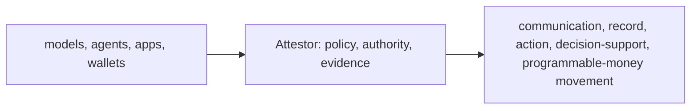

# Attestor

**Policy-bound release and authorization platform for high-consequence systems.**

One API. One platform core. Modular packs for finance, crypto, and later consequence domains.

Attestor sits before consequence.

It is built for teams that will not let AI-assisted outputs, operational actions, financial records, or programmable-money movements cross into real consequence without policy, authority, and durable evidence.

Attestor decides whether a proposed consequence may proceed; under what policy; with what authority; and with what evidence left behind.

In practice, that means teams use Attestor to:

- admit, narrow, review, or block proposed consequences before they become real
- bind release decisions to policy and authority instead of informal operator judgment
- produce portable proof and independent verification artifacts
- enforce the same control model across finance and programmable-money execution paths

Attestor is not the model, agent runtime, wallet, custody platform, or orchestration layer. It is the release, authorization, and evidence layer between a proposed consequence and the system that would carry it out.

> [!IMPORTANT]
> Attestor does not try to prove that AI or programmable execution is universally trustworthy. It gives teams a disciplined way to decide when a proposed consequence can be accepted, and when it must be blocked, reviewed, narrowed, or bounded more tightly.

> [!NOTE]
> This repository is source-available under the Business Source License 1.1. Public source access is allowed, non-production use is allowed, and production use requires a commercial license until the Change Date listed in [LICENSE](LICENSE).

## What Attestor Is

Attestor answers four questions:

- may this proposed consequence proceed at all?
- under what policy may it move forward?
- who or what authority can approve it?
- what evidence survives after the decision?

That pattern applies across both AI and programmable-money workflows.



## One Product, Modular Packs

Attestor is one product.

The core platform stays the same across domains:

- release decisions decide whether a proposed consequence can move at all
- policy control-plane bundles define which rules are active for a scoped workload or tenant
- enforcement-plane verifiers and gateways fail closed at downstream boundaries
- authorization objects and simulations provide the portable substrate for higher-consequence execution paths

The packs sit on top of that shared platform:

- **finance pack**: the deepest proven wedge today, centered on financial reporting and finance operations
- **crypto pack**: the programmable-money extension, built on the same policy, proof, and authorization model
- **later packs**: additional consequence or domain packs can attach to the same Attestor core without turning into separate products by default

## Current Proof Wedge

The strongest end-to-end proving path today is finance.

The first hard gateway wedge is:

**AI output -> structured financial record release**

That is the point where weak acceptance models break fast: silent errors are expensive, controls must be legible, auditability is mandatory, and reviewer authority matters.

Finance is the current proving ground, not the ceiling of the platform.

For the detailed wedge framing, see [AI-assisted financial reporting acceptance](docs/01-overview/financial-reporting-acceptance.md).

## Platform Core

The platform core is where Attestor already has the strongest product truth:

| Core layer | Role | Status |
|---|---|---|
| Release layer | release decisions, tokens, canonicalization, deterministic checks, reviewer queue, evidence packs | `24 / 24` complete, packaged |
| Policy control plane | signed policy bundles, activation, rollback, scoping, simulation, impact summaries, audit log | `20 / 20` complete, packaged |
| Enforcement plane | offline/online verification, DPoP, mTLS/SPIFFE, HTTP message signatures, gateways, proxy enforcement | `20 / 20` complete, packaged |
| Crypto authorization core | programmable-money authorization vocabulary, object model, bindings, simulation, and adapter preflight | `20 / 20` complete, packaged |

### Public Package Surfaces

| Layer | Public package surface |
|---|---|
| Release layer | `attestor/release-layer` |
| Finance proving pack | `attestor/release-layer/finance` |
| Policy control plane | `attestor/release-policy-control-plane` |
| Enforcement plane | `attestor/release-enforcement-plane` |
| Crypto authorization pack | `attestor/crypto-authorization-core` |
| Crypto execution-admission pack | `attestor/crypto-execution-admission` |

## Pack Status

### Finance Pack

The finance pack is the most mature Attestor pack today.

It includes:

- SQL governance
- policy and entitlement checks
- execution guardrails
- fixture, SQLite, and bounded PostgreSQL execution
- data contracts and reconciliation logic
- semantic clauses
- filing readiness
- signed certificates and verification kits
- reviewer endorsement and authority closure
- finance record-release enforcement as the first hard gateway wedge

### Crypto Pack

The crypto pack is an extension of the same Attestor core, not a separate product.

Its job is simple: apply the same policy, authority, proof, and fail-closed admission discipline to programmable-money execution before value actually moves.

Current status:

- `attestor/crypto-authorization-core`: `20 / 20` complete, packaged
- `attestor/crypto-execution-admission`: `6 / 12` complete, active buildout

What the crypto pack already covers:

- canonical chain/account/asset/consequence vocabulary
- EIP-712 authorization envelopes
- ERC-1271 validation projection
- replay, nonce, expiry, and revocation rules
- release, policy, and enforcement binding
- pre-execution simulation
- Safe transaction and module guard adapters
- ERC-4337 UserOperation adapter
- ERC-7579 and ERC-6900 modular account adapters
- EIP-7702 delegation-aware adapter
- x402 agentic payment adapter
- custody co-signer and policy-engine adapter
- execution-admission planning, wallet RPC handoffs, Safe guard receipts, ERC-4337 bundler handoffs, modular-account runtime handoffs, and delegated-EOA runtime handoffs

Next frozen crypto step:

- Step 07: x402 resource-server admission middleware

## Proof And Verification

The strongest black-and-white evidence in this repository is reproducible proof generation and independent verification.

| Evidence path | What it proves |
|---|---|
| `npm run showcase:proof:hybrid` | generates a live hybrid packet from a real upstream model call, bounded SQLite execution, reviewer endorsement, and PKI-backed proof material |
| `npm run verify:cert -- .attestor/showcase/latest/evidence/kit.json` | independently verifies the generated portable verification kit outside the main runtime |
| `npm run showcase:proof` | generates a PostgreSQL-grounded packet with deeper schema/data-state evidence |
| `docs/evidence/financial-reporting-acceptance-live-hybrid/` | committed sample packet for the counterparty exposure reporting-acceptance flow |

Shortest proof path:

```bash
npm run showcase:proof:hybrid
npm run verify:cert -- .attestor/showcase/latest/evidence/kit.json
```

## Quick Start

```bash
npm install

# List financial reference scenarios
npm run list

# Fixture run, no keys or database needed
npm run scenario -- counterparty

# Check signing / model / database readiness
npm run start -- doctor

# Signed single-query proof
npm run prove -- counterparty

# Live hybrid proof + packet, requires OPENAI_API_KEY
npm run showcase:proof:hybrid

# Verify a kit
npm run verify:cert -- .attestor/proofs/<run>/kit.json

# Core verification gate
npm test

# Local safe gate
npm run verify
```

## Main Commands

| Command | Purpose |
|---|---|
| `npm run typecheck` | TypeScript check without emit |
| `npm test` | Core verification gate |
| `npm run build` | Compile TypeScript to `dist/` |
| `npm run verify` | Typecheck, core tests, build, and package-surface probes |
| `npm run verify:full` | Wider local and env-gated integration verification |
| `npm run test:release-layer-package-surface` | Probe packaged release-layer imports |
| `npm run test:release-policy-control-plane-package-surface` | Probe packaged policy-control-plane imports |
| `npm run test:release-enforcement-plane-package-surface` | Probe packaged enforcement-plane imports |
| `npm run test:crypto-authorization-core-package-surface` | Probe packaged crypto-authorization-core imports |
| `npm run test:crypto-execution-admission-package-surface` | Probe packaged crypto-execution-admission imports |

## Documentation Map

| Topic | Link |
|---|---|
| System overview | [docs/02-architecture/system-overview.md](docs/02-architecture/system-overview.md) |
| Release layer tracker | [docs/02-architecture/release-layer-buildout.md](docs/02-architecture/release-layer-buildout.md) |
| Release layer package surface | [docs/02-architecture/release-layer-platform-surface.md](docs/02-architecture/release-layer-platform-surface.md) |
| Policy control-plane tracker | [docs/02-architecture/release-policy-control-plane-buildout.md](docs/02-architecture/release-policy-control-plane-buildout.md) |
| Policy control-plane package surface | [docs/02-architecture/release-policy-control-plane-platform-surface.md](docs/02-architecture/release-policy-control-plane-platform-surface.md) |
| Enforcement-plane tracker | [docs/02-architecture/release-enforcement-plane-buildout.md](docs/02-architecture/release-enforcement-plane-buildout.md) |
| Enforcement-plane package surface | [docs/02-architecture/release-enforcement-plane-platform-surface.md](docs/02-architecture/release-enforcement-plane-platform-surface.md) |
| Crypto authorization core tracker | [docs/02-architecture/crypto-authorization-core-buildout.md](docs/02-architecture/crypto-authorization-core-buildout.md) |
| Crypto authorization core package surface | [docs/02-architecture/crypto-authorization-core-platform-surface.md](docs/02-architecture/crypto-authorization-core-platform-surface.md) |
| Crypto execution-admission tracker | [docs/02-architecture/crypto-execution-admission-buildout.md](docs/02-architecture/crypto-execution-admission-buildout.md) |
| Crypto execution-admission package surface | [docs/02-architecture/crypto-execution-admission-platform-surface.md](docs/02-architecture/crypto-execution-admission-platform-surface.md) |
| Financial reporting wedge | [docs/01-overview/financial-reporting-acceptance.md](docs/01-overview/financial-reporting-acceptance.md) |
| Product packaging and pricing | [docs/01-overview/product-packaging.md](docs/01-overview/product-packaging.md) |
| Hosted customer journey | [docs/01-overview/hosted-customer-journey.md](docs/01-overview/hosted-customer-journey.md) |
| Production readiness | [docs/08-deployment/production-readiness.md](docs/08-deployment/production-readiness.md) |
| Deployment and DR | [docs/08-deployment/deployment.md](docs/08-deployment/deployment.md), [docs/08-deployment/backup-restore-dr.md](docs/08-deployment/backup-restore-dr.md) |

## Project Status

| Field | Value |
|---|---|
| Version | `1.0.0` |
| Runtime | Node.js 22+, TypeScript, split API + worker CLI + bounded HTTP API |
| Release layer | `24 / 24` complete |
| Release policy control plane | `20 / 20` complete |
| Release enforcement plane | `20 / 20` complete |
| Crypto authorization core | `20 / 20` complete, packaged |
| Crypto execution admission | `6 / 12` complete, active buildout |
| Verification | covered by `npm test`, `npm run verify`, and `npm run verify:full` |
| Package probes | release layer, policy control plane, enforcement plane, crypto authorization core, and crypto execution admission package surfaces are covered |
| License | Business Source License 1.1, Change License `GPL-2.0-or-later` on 2030-04-13 |

## What Attestor Is Not

- Not a financial chatbot
- Not an LLM orchestration framework
- Not a BI dashboard
- Not a customer-facing automated decision engine
- Not a regulatory submission platform
- Not a wallet or custody platform
- Not proof that AI is inherently trustworthy
