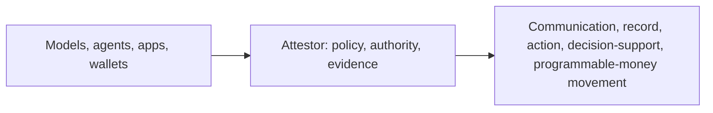

# Attestor

**Policy-bound release and execution-authorization infrastructure for high-consequence AI, finance, and programmable money.**

Attestor sits before consequence.

It decides whether an AI-assisted output, operational action, financial record, or programmable-money movement may proceed; under what policy; with what authority; and with what evidence left behind.

Attestor is not the model, agent runtime, wallet, custody platform, or orchestration layer. It is the authorization and evidence layer between a proposed consequence and the system that would carry it out.

> [!IMPORTANT]
> Attestor does not try to prove that AI or programmable execution is universally trustworthy. It gives teams a disciplined way to decide when a proposed consequence can be accepted, and when it must be blocked, reviewed, narrowed, or bounded more tightly.

> [!NOTE]
> This repository is source-available under the Business Source License 1.1. Public source access is allowed, non-production use is allowed, and production use requires a commercial license until the Change Date listed in [LICENSE](LICENSE).

## At a Glance

| If you need to... | Attestor gives you... |
|---|---|
| decide whether a proposed consequence may proceed | release decisions, policy checks, authority binding, deterministic evidence |
| release AI-assisted output into serious workflows | typed contracts, bounded execution, reviewer routing, signed release artifacts |
| enforce decisions downstream | fail-closed HTTP, webhook, async, record, communication, action, and proxy enforcement points |
| prove later why something was accepted | signed certificates, verification kits, audit trail, schema/data-state attestation |
| prepare for programmable-money authorization | chain/account/asset/consequence vocabulary, wallet and custody adapter path, crypto authorization tracker |
| run it as a real product surface | hosted auth, billing, observability, HA, DR, promotion packets |

## Quick Navigation

- [What Attestor is](#what-attestor-is)
- [Why it exists](#why-it-exists)
- [Modular architecture](#modular-architecture)
- [Current proving ground](#current-proving-ground)
- [Crypto authorization direction](#crypto-authorization-direction)
- [Proof and verification](#proof-and-verification)
- [Quick start](#quick-start)
- [Documentation map](#documentation-map)
- [Project status](#project-status)

Buildout trackers:

- [Release layer buildout](docs/02-architecture/release-layer-buildout.md)
- [Release policy control-plane buildout](docs/02-architecture/release-policy-control-plane-buildout.md)
- [Release enforcement-plane buildout](docs/02-architecture/release-enforcement-plane-buildout.md)
- [Crypto authorization core buildout](docs/02-architecture/crypto-authorization-core-buildout.md)
- [Crypto execution admission buildout](docs/02-architecture/crypto-execution-admission-buildout.md)

## What Attestor Is

Attestor is the release, policy, enforcement, and execution-authorization layer for high-consequence workflows.

It governs whether a proposed output, action, record, or programmable-money movement may move forward automatically, under review, or not at all. It also records how that release was evidenced, who could authorize it, and what a third party can verify afterward.

The category is:

**the layer that decides whether a proposed consequence may proceed**

For AI and workflow systems, that currently means these release-layer consequence types:

- `communication`
- `record`
- `action`
- `decision-support`

For programmable-money systems, the new crypto authorization core extends the same pattern toward:

- `transfer`
- `approval`
- `permission-grant`
- `account-delegation`
- `user-operation`
- `agent-payment`
- `custody-withdrawal`
- `governance-action`

## Why It Exists

The hard bottleneck in serious AI and programmable execution workflows is no longer generation. It is authorized release into consequence.



Without that middle layer, high-consequence work either stays advisory or gets pushed forward informally. With Attestor, consequence becomes something that must be authorized, not merely hoped for.

Attestor answers four questions:

- may this proposed consequence proceed at all?
- under what policy may it move forward?
- who or what authority can approve it?
- what evidence survives after the decision?

## Modular Architecture

Attestor is intentionally organized as layered platform modules instead of one large monolith.

| Module | Role | Status |
|---|---|---|
| Release layer | Decides whether outputs can become communication, records, actions, or decision support | `24 / 24` complete, packaged |
| Release policy control plane | Stores, signs, scopes, activates, rolls out, simulates, and audits policy | `20 / 20` complete, packaged |
| Release enforcement plane | Verifies authorization at downstream boundaries and fails closed without it | `20 / 20` complete, packaged |
| Crypto authorization core | Describes programmable-money authorization before wallet, contract, custody, payment, or agent execution | `20 / 20` complete, packaged |
| Domain and adapter layers | Finance, healthcare, filing, connector, wallet/account/custody adapters | Expanded by tracker, not by ad hoc README growth |

Reusable package surfaces:

- `attestor/release-layer`
- `attestor/release-layer/finance`
- `attestor/release-policy-control-plane`
- `attestor/release-enforcement-plane`
- `attestor/crypto-authorization-core`
- `attestor/crypto-execution-admission`

The crypto authorization core is packaged behind a stable subpath now, while still living inside the modular monolith until latency, custody, isolation, or customer-operated requirements justify a separate deployable boundary.

## Current Proving Ground

The deepest proven wedge today is financial reporting and finance operations.

Finance matters because weak acceptance models break fast there: silent errors are expensive, controls must be legible, auditability is mandatory, and reviewer authority matters.

The first hard gateway wedge is:

**AI output -> structured financial record release**

That means the first fail-closed boundary is not chat, not generic decision support, and not arbitrary tool execution. It is the moment an AI-assisted output would otherwise become a durable reporting record, filing-preparation payload, or structured reporting artifact.

For the detailed wedge framing, see [AI-assisted financial reporting acceptance](docs/01-overview/financial-reporting-acceptance.md).

Finance is the proving ground, not the ceiling.

## Crypto Authorization Direction

The next platform expansion is not "add a crypto feature." It is to make Attestor a core authorization substrate before programmable money moves.

The design rule is **core first, adapter second**:

- the crypto authorization core defines chain, account, asset, consequence, policy, artifact, and adapter vocabulary
- Safe, ERC-4337, ERC-7579, ERC-6900, EIP-7702, x402, custody, and intent paths become adapters to that core
- adapters know about the core, but the core does not become a Safe-specific or vendor-specific model
- release-layer decisions, policy-control-plane scope, and enforcement-plane verification remain the reusable backbone

Current crypto authorization status:

- tracker: [docs/02-architecture/crypto-authorization-core-buildout.md](docs/02-architecture/crypto-authorization-core-buildout.md)
- completed: Step 01, crypto authorization vocabulary; Step 02, versioned authorization object model; Step 03, canonical chain/account/asset/counterparty references; Step 04, deterministic consequence risk mapping; Step 05, EIP-712 typed authorization envelopes; Step 06, ERC-1271 smart-account validation projection; Step 07, replay, nonce, expiry, and revocation rules; Step 08, release-layer decision binding; Step 09, policy-control-plane scope binding; Step 10, enforcement-plane verification binding; Step 11, crypto authorization simulation surface; Step 12, Safe transaction guard adapter; Step 13, Safe module guard adapter; Step 14, approval and allowance consequence support; Step 15, ERC-4337 UserOperation adapter; Step 16, ERC-7579 and ERC-6900 modular account adapters; Step 17, EIP-7702 delegation-aware adapter; Step 18, x402 agentic payment adapter; Step 19, custody co-signer and policy-engine adapter; Step 20, reusable platform package surface
- next tracker: [docs/02-architecture/crypto-execution-admission-buildout.md](docs/02-architecture/crypto-execution-admission-buildout.md), Steps 01-02 complete, defining the packaged execution admission planner and wallet RPC handoff for EIP-5792, ERC-7715, and ERC-7902
- code: `src/crypto-authorization-core/index.ts`, `src/crypto-authorization-core/types.ts`, `src/crypto-authorization-core/object-model.ts`, `src/crypto-authorization-core/canonical-references.ts`, `src/crypto-authorization-core/consequence-risk-mapping.ts`, `src/crypto-authorization-core/eip712-authorization-envelope.ts`, `src/crypto-authorization-core/erc1271-validation-projection.ts`, `src/crypto-authorization-core/replay-freshness-rules.ts`, `src/crypto-authorization-core/release-decision-binding.ts`, `src/crypto-authorization-core/policy-control-plane-scope-binding.ts`, `src/crypto-authorization-core/enforcement-plane-verification.ts`, `src/crypto-authorization-core/authorization-simulation.ts`, `src/crypto-authorization-core/safe-transaction-guard-adapter.ts`, `src/crypto-authorization-core/safe-module-guard-adapter.ts`, `src/crypto-authorization-core/approval-allowance-consequence.ts`, `src/crypto-authorization-core/erc4337-user-operation-adapter.ts`, `src/crypto-authorization-core/modular-account-adapters.ts`, `src/crypto-authorization-core/eip7702-delegation-adapter.ts`, `src/crypto-authorization-core/x402-agentic-payment-adapter.ts`, `src/crypto-authorization-core/custody-cosigner-policy-adapter.ts`
- tests: `tests/crypto-authorization-core-types.test.ts`, `tests/crypto-authorization-core-object-model.test.ts`, `tests/crypto-authorization-core-canonical-references.test.ts`, `tests/crypto-authorization-core-risk-mapping.test.ts`, `tests/crypto-authorization-core-eip712-envelope.test.ts`, `tests/crypto-authorization-core-erc1271-validation.test.ts`, `tests/crypto-authorization-core-replay-freshness.test.ts`, `tests/crypto-authorization-core-release-binding.test.ts`, `tests/crypto-authorization-core-policy-scope-binding.test.ts`, `tests/crypto-authorization-core-enforcement-verification.test.ts`, `tests/crypto-authorization-core-authorization-simulation.test.ts`, `tests/crypto-authorization-core-safe-transaction-guard-adapter.test.ts`, `tests/crypto-authorization-core-safe-module-guard-adapter.test.ts`, `tests/crypto-authorization-core-approval-allowance-consequence.test.ts`, `tests/crypto-authorization-core-erc4337-user-operation-adapter.test.ts`, `tests/crypto-authorization-core-modular-account-adapters.test.ts`, `tests/crypto-authorization-core-eip7702-delegation-adapter.test.ts`, `tests/crypto-authorization-core-x402-agentic-payment-adapter.test.ts`, `tests/crypto-authorization-core-custody-cosigner-policy-adapter.test.ts`, `tests/crypto-authorization-core-platform-surface.test.ts`
- admission code: `src/crypto-execution-admission/index.ts`, `src/crypto-execution-admission/wallet-rpc.ts`
- admission tests: `tests/crypto-execution-admission.test.ts`, `tests/crypto-execution-admission-wallet-rpc.test.ts`
- next: continue the crypto execution admission tracker with Safe guard admission receipts

## What Ships

| Area | Current shipped surface |
|---|---|
| Engine core | typed contracts, governance, guardrails, bounded execution, reviewer authority, signed proof, verification kits, multi-query proof |
| Release platform | release decisions, tokens, canonicalization, deterministic checks, introspection, evidence packs, reviewer queue |
| Policy platform | signed policy bundles, activation, rollback, scoping, simulation, impact summaries, audit log, progressive rollout |
| Enforcement platform | offline/online verification, DPoP, mTLS/SPIFFE, HTTP message signatures, async envelopes, middleware, webhook receiver, record/communication/action gateways, Envoy ext_authz, degraded mode, telemetry, conformance |
| Product surface | bounded API + worker topology, hosted auth/RBAC, billing, tenant/runtime policy, observability, HA, DR, secret-manager bootstrap, promotion packets |
| Domain depth | finance as the deepest slice, healthcare as a second slice, PostgreSQL + Snowflake connectors, filing adapters |
| Crypto core | packaged `attestor/crypto-authorization-core` surface for vocabulary, object-model, canonical-reference, risk-mapping, EIP-712 envelope, ERC-1271 validation-projection, replay/freshness, release-decision binding, policy-control-plane scope binding, enforcement-plane verification binding, pre-execution simulation, Safe transaction guard adapter, Safe module guard adapter, approval/allowance consequence support, ERC-4337 UserOperation preflight, ERC-7579/ERC-6900 modular account adapter preflight, EIP-7702 delegated EOA preflight, x402 agentic payment preflight, and custody co-signer/policy-engine preflight |
| Crypto execution admission | packaged `attestor/crypto-execution-admission` surface for converting core simulations into concrete wallet, smart-account guard, bundler, delegated EOA, x402, custody, and intent-solver admission plans, plus wallet RPC handoffs for EIP-5792 call batches, ERC-7715 execution permissions, and ERC-7902 account-abstraction capabilities |

## Proof and Verification

The strongest black-and-white evidence in this repository is reproducible proof generation and independent verification.

| Evidence path | What it proves |
|---|---|
| `npm run showcase:proof:hybrid` | generates a live hybrid packet from a real upstream model call, bounded SQLite execution, reviewer endorsement, and PKI-backed proof material |
| `npm run verify:cert -- .attestor/showcase/latest/evidence/kit.json` | independently verifies the generated portable verification kit outside the main runtime |
| `npm run showcase:proof` | generates a PostgreSQL-grounded packet with deeper schema/data-state evidence |
| `docs/evidence/financial-reporting-acceptance-live-hybrid/` | committed sample packet for the counterparty exposure reporting-acceptance flow |

Shortest proof path:

```bash
npm run showcase:proof:hybrid
npm run verify:cert -- .attestor/showcase/latest/evidence/kit.json
```

## Product Surface

Attestor is best understood as a hosted release, proof, and control layer delivered through APIs. Customers keep their data, workflows, wallets, custody systems, and operational environment where they already live.

What customers get:

- hosted account and tenant boundary
- API keys
- usage and billing visibility
- proof, verification, and filing-capable API surfaces
- reviewer and operator control surfaces
- deployment and promotion guidance

Commercial docs:

- [Hosted customer journey](docs/01-overview/hosted-customer-journey.md)
- [Product packaging and pricing](docs/01-overview/product-packaging.md)
- [Stripe commercial bootstrap](docs/01-overview/stripe-commercial-bootstrap.md)

## Quick Start

```bash
npm install

# List financial reference scenarios
npm run list

# Fixture run, no keys or database needed
npm run scenario -- counterparty

# Check signing / model / database readiness
npm run start -- doctor

# Signed single-query proof
npm run prove -- counterparty

# Live hybrid proof + packet, requires OPENAI_API_KEY
npm run showcase:proof:hybrid

# Verify a kit
npm run verify:cert -- .attestor/proofs/<run>/kit.json

# Core unit suites
npm test

# Safe local verification gate
npm run verify

# Expanded verification surface
npm run verify:full
```

## Main Scripts

| Command | Purpose |
|---|---|
| `npm run typecheck` | TypeScript check without emit |
| `npm test` | Core verification gate |
| `npm run build` | Compile TypeScript to `dist/` |
| `npm run verify` | Typecheck, core tests, build, and package-surface probes |
| `npm run verify:full` | Safe local gate plus wider live/integration suites; some are env-gated |
| `npm run test:release-layer-package-surface` | Probe packaged release-layer imports |
| `npm run test:release-policy-control-plane-package-surface` | Probe packaged policy-control-plane imports |
| `npm run test:release-enforcement-plane-package-surface` | Probe packaged enforcement-plane imports |
| `npm run render:production-readiness-packet` | Render final observability + HA readiness handoff packet |
| `npm run render:secret-manager-bootstrap` | Render managed secret bootstrap contracts |

## Documentation Map

| Topic | Link |
|---|---|
| System overview | [docs/02-architecture/system-overview.md](docs/02-architecture/system-overview.md) |
| Release layer tracker | [docs/02-architecture/release-layer-buildout.md](docs/02-architecture/release-layer-buildout.md) |
| Release layer package surface | [docs/02-architecture/release-layer-platform-surface.md](docs/02-architecture/release-layer-platform-surface.md) |
| Policy control-plane tracker | [docs/02-architecture/release-policy-control-plane-buildout.md](docs/02-architecture/release-policy-control-plane-buildout.md) |
| Policy control-plane package surface | [docs/02-architecture/release-policy-control-plane-platform-surface.md](docs/02-architecture/release-policy-control-plane-platform-surface.md) |
| Enforcement-plane tracker | [docs/02-architecture/release-enforcement-plane-buildout.md](docs/02-architecture/release-enforcement-plane-buildout.md) |
| Enforcement-plane package surface | [docs/02-architecture/release-enforcement-plane-platform-surface.md](docs/02-architecture/release-enforcement-plane-platform-surface.md) |
| Crypto authorization core tracker | [docs/02-architecture/crypto-authorization-core-buildout.md](docs/02-architecture/crypto-authorization-core-buildout.md) |
| Crypto authorization core package surface | [docs/02-architecture/crypto-authorization-core-platform-surface.md](docs/02-architecture/crypto-authorization-core-platform-surface.md) |
| Financial reporting wedge | [docs/01-overview/financial-reporting-acceptance.md](docs/01-overview/financial-reporting-acceptance.md) |
| Production readiness | [docs/08-deployment/production-readiness.md](docs/08-deployment/production-readiness.md) |
| Deployment and DR | [docs/08-deployment/deployment.md](docs/08-deployment/deployment.md), [docs/08-deployment/backup-restore-dr.md](docs/08-deployment/backup-restore-dr.md) |

Detailed API inventories, environment-specific setup, and long operational reference material belong in docs and source-owned route files, not in this README.

## Project Status

| Field | Value |
|---|---|
| Version | `1.0.0` |
| Runtime | Node.js 22+, TypeScript, split API + worker CLI + bounded HTTP API |
| Release layer | `24 / 24` complete |
| Release policy control plane | `20 / 20` complete |
| Release enforcement plane | `20 / 20` complete |
| Crypto authorization core | `20 / 20` complete, packaged |
| Core verification gate | `3420` checks via `npm test` |
| Expanded verification surface | `4971` checks across `124` suites via local, live, and env-gated integration paths |
| Latest crypto artifact | `src/crypto-authorization-core/index.ts` with `31` focused platform-surface checks |
| Package probes | release layer, policy control plane, enforcement plane, and crypto authorization core package surfaces all covered |
| License | Business Source License 1.1, Change License `GPL-2.0-or-later` on 2030-04-13 |

## What Attestor Is Not

- Not a financial chatbot
- Not an LLM orchestration framework
- Not a BI dashboard
- Not a customer-facing automated decision engine
- Not a regulatory submission platform
- Not a wallet or custody platform
- Not proof that AI is inherently trustworthy
