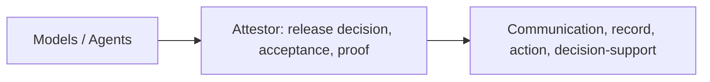
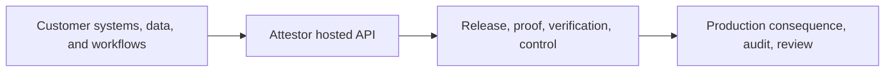
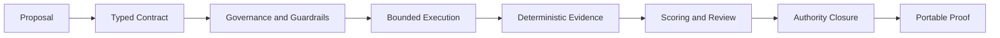
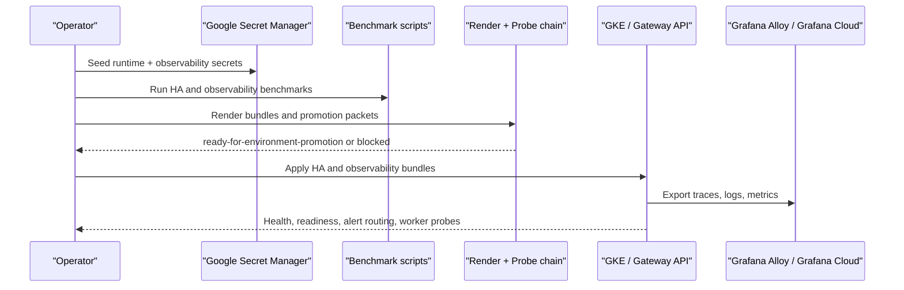

# Attestor

**AI output release and acceptance infrastructure for high-consequence AI systems, proven first on financial reporting workflows.**

Most AI systems can produce something useful before a team knows whether that output may safely enter a real consequence. That is the gap Attestor is built to close.

Attestor sits between AI output and consequence. It does not try to be the model, the agent runtime, or the orchestration layer. It decides whether an output may be released into communication, record, action, or decision-support, under what conditions, with what authority, and with what evidence left behind.

The current proving wedge is financial: reporting, treasury, risk, reconciliation, and filing-oriented evidence. The architectural pattern can travel beyond finance, but the repo should be read first as a finance-proven release and consequence-gateway product, not as a generic AI platform claim.

> [!IMPORTANT]
> Attestor does not try to prove that AI is universally trustworthy. It gives teams a disciplined way to decide when AI-assisted work can be accepted, and when it must still be blocked, reviewed, or bounded more tightly.

> [!NOTE]
> This repository is source-available under the Business Source License 1.1. Public source access is allowed, non-production use is allowed, and production use requires a commercial license until the Change Date listed in [LICENSE](/C:/Users/thedi/attestor/LICENSE).

## At a Glance

| If you need to... | Attestor gives you... |
|---|---|
| decide whether AI-assisted output may safely move into consequence | typed contracts, bounded execution, release discipline, deterministic evidence |
| prove later why a reporting output was accepted | signed certificates, verification kits, audit trail, schema/data-state attestation |
| run it as an actual product surface | hosted auth, billing, observability, HA, DR, promotion packets |
| expand the same release model later | finance-proven depth, healthcare slice, connector + filing adapter model |

## Quick Navigation

- [Why this exists](#why-this-exists)
- [How customers buy and use Attestor](#how-customers-buy-and-use-attestor)
- [Hosted customer journey](#hosted-customer-journey)
- [Plans and pricing](#plans-and-pricing)
- [What ships in this repository](#what-ships-in-this-repository)
- [Recommended production path](#recommended-production-path)
- [Quick start](#quick-start)
- [Current verified evidence](#current-verified-evidence)
- [Current demo and test surface](#current-demo-and-test-surface)
- [Release layer buildout tracker](docs/02-architecture/release-layer-buildout.md)
- [Financial reporting acceptance wedge](docs/01-overview/financial-reporting-acceptance.md)
- [Hosted customer journey doc](docs/01-overview/hosted-customer-journey.md)
- [Stripe commercial bootstrap](docs/01-overview/stripe-commercial-bootstrap.md)
- [Product packaging and pricing](docs/01-overview/product-packaging.md)
- [Production readiness guide](docs/08-deployment/production-readiness.md)
- [Project status](#project-status)

## The Step Change

The practical jump is not from "no AI" to "AI". It is from "AI can suggest" to "AI output may enter consequence only after a release decision with evidence, policy, and authority."



Without that middle layer, many AI systems stay advisory or get pushed forward informally. With it, teams can treat consequence as something that must be authorized, not merely hoped for.

## Why This Exists

The deepest AI bottleneck is no longer generation. It is release into consequence.

In serious reporting and control workflows, the key questions are not only "can the model say something helpful?" but also:

- may this output be released at all?
- under what conditions may it move forward?
- who is allowed to authorize that release?
- what evidence survives after the release decision?

Attestor answers those questions with a release layer:

- output contracts define what kind of consequence is even in scope
- capability boundaries constrain what the system may touch before release
- acceptance policy turns findings into a governed release decision
- proof becomes portable instead of trapped inside one runtime
- authority is explicit instead of implied

## Core Category

The first thing Attestor should mean is not "AI platform."

It should mean:

**the layer that decides whether AI output may enter consequence**

In practice, that means Attestor sits before four consequence types:

- `communication`
- `record`
- `action`
- `decision-support`

The first proving wedge remains financial:

**AI-assisted financial reporting acceptance.**

The first hard gateway wedge inside that proving ground is now frozen as:

**AI output -> structured financial record release**

That means the first fail-closed boundary is not chat, not generic decision support, and not arbitrary tool execution. It is the moment an AI-assisted output would otherwise become a durable reporting record, filing-preparation payload, or structured reporting artifact.

That wedge means:

- a report section, metric, or filing-oriented output may be generated or assisted by AI
- the workflow still needs a clear acceptance boundary before someone relies on it
- Attestor supplies the release decision, evidence, reviewer authority, verification material, and control surface around that boundary

For the detailed wedge framing and current official anchors, see [AI-assisted financial reporting acceptance](docs/01-overview/financial-reporting-acceptance.md).

## Why Finance Is First

Finance is where weak acceptance models break fastest. Silent errors are expensive, controls must be legible, auditability is mandatory, and reviewer authority matters. If the architecture survives here, it has earned the right to expand elsewhere.

Finance is the proving ground, not the ceiling.

## Proof Maturity Today

Attestor keeps maturity claims separated by track.

| Track | What is real today |
|---|---|
| Single-query proof | signed certificates, verification kits, run-bound reviewer endorsements, independent verification CLI |
| Shareable proof packets | real PostgreSQL packet via `npm run showcase:proof`, live hybrid packet via `npm run showcase:proof:hybrid` |
| Multi-query proof | aggregate governance, signed multi-query certificates, portable multi-query kits, differential evidence |
| Runtime proof | bounded execution, predictive guardrails, reproducible PostgreSQL bootstrap, Postgres schema/data-state attestation |

## Canonical Proof Surface

The default product proof is not a generic AI demo. It is a finance-first acceptance packet for a reporting workflow.

- canonical scenario: counterparty exposure reporting acceptance
- canonical live proof command: `npm run showcase:proof:hybrid`
- canonical verification command: `npm run verify:cert -- .attestor/showcase/latest/evidence/kit.json`
- committed sample packet: [docs/evidence/financial-reporting-acceptance-live-hybrid/README.md](docs/evidence/financial-reporting-acceptance-live-hybrid/README.md)

## What Ships in This Repository

Attestor is already more than a verifier demo, finance helper, or lab prototype.

| Layer | What is already shipped |
|---|---|
| Engine core | typed contracts, governance, guardrails, bounded execution, PKI-backed proof, reviewer authority, verification kits, multi-query proof |
| Product surface | bounded API + worker topology, hosted auth/RBAC, billing, tenant/runtime policy, observability, HA, DR, secret-manager bootstrap, promotion packets |
| Domain depth | finance as the deepest slice, healthcare as a second slice, PostgreSQL + Snowflake connectors, filing adapters |

That is the real jump: not only generating reporting work with AI, but making AI-assisted reporting work acceptable inside systems that still need evidence, authority, and operational discipline.

<details>
<summary>Detailed shipped modules</summary>

**Engine core**

- Authority chain: warrant -> escrow -> receipt -> capsule
- Deterministic scorer cascade with priority short-circuit
- Evidence chain, provenance, and hash-linked audit trail
- Ed25519 signing and certificate verification
- Keyless-first API signing with short-lived CA-issued certificates
- JSON-based PKI trust chain module with API-path issuance and chain verification
- Reviewer identity, endorsement, and run binding
- Single-query and multi-query certificate issuance
- Differential evidence for multi-query comparison

**Reference financial implementation**

- SQL governance and entitlement checks
- Execution guardrails
- Data contracts and reconciliation logic
- Five semantic clause types
- Filing readiness assessment
- PostgreSQL proof path and demo bootstrap

**Expansion modules already present**

- Domain pack registry with `finance` and `healthcare`
- Connector registry with PostgreSQL and Snowflake modules
- Filing adapter registry with XBRL US-GAAP 2024 and xBRL-CSV EBA DPM 2.0 adapters
- Bounded HTTP API server with sync and async first-slice routes
- OIDC reviewer identity verification on the API path, plus OS keychain-backed session management (`@napi-rs/keyring` native keychain with encrypted-file fallback) + device flow in the CLI proof path
- BullMQ/Redis async orchestration with 3-tier auto-resolution (`REDIS_URL` -> localhost:6379 -> embedded Redis), in-process fallback when all Redis tiers unavailable

</details>

## What Attestor Is

Attestor is the release layer and operating layer for AI-assisted high-stakes workflows.

It does not generate the answer. It governs whether the output may be released, how that release is evidenced, who may authorize it, and what a third party can verify afterward.

The recognition to have here is simple: most of the missing infrastructure in AI is not more intelligence. It is better release discipline.

## What Changes in Practice

| Without a release layer | With Attestor |
|---|---|
| AI output remains advisory, hard to endorse, and hard to audit | AI-assisted output can move through bounded release with evidence and authority |
| trust lives in people, screenshots, and implicit judgment | trust is decomposed into explicit authority, policy, evidence, and verification |
| production rollout becomes a collection of one-off controls | product and ops surfaces become repeatable: auth, billing, observability, HA, DR |
| each new domain reinvents the same governance questions | the acceptance model can travel, even when the domain logic changes |

## How Customers Buy and Use Attestor

Attestor is not a file workspace and not a document app.

Customers buy **hosted API access to the release, proof, and control layer**. They keep their files, data, workflows, and business logic in their own environment, then call Attestor where consequence needs to be authorized instead of informally passed through.

What a paying customer should expect to receive:

- a hosted account and tenant boundary
- API keys
- usage and billing visibility
- entitlement and feature state
- proof, verification, and filing-capable API surfaces
- docs and deployment guidance

What they should not expect:

- a hosted file manager
- a drag-and-drop workspace
- an AI chat shell

The commercial product is best understood as **infrastructure delivered as a hosted API product**.



The repo and docs should already function as the commercial surface. A serious buyer should be able to understand the product, pick a plan, sign up, upgrade through Stripe, and start integrating without ever needing a file workspace.

## Hosted Customer Journey

The intended hosted path is deliberately simple:

1. sign up for a hosted account
2. receive the first tenant API key immediately
3. upgrade through Stripe Checkout when paid volume or support is needed
4. sign in to manage API keys, usage, and billing
5. call Attestor from the customer's own environment

### The 3-Second Version

If you just want the shortest practical explanation:

- `community` = try Attestor first
- `starter`, `pro`, `enterprise` = paid plans on the same account
- first create the account, then open Stripe Checkout for the plan you want, then pay, then keep using that same account

### How To Activate A Plan

Use this exact order:

1. Create the account:
   send `accountName`, `email`, `displayName`, and `password` to `POST /api/v1/auth/signup`
2. Start checkout for the plan:
   send `planId` (`starter`, `pro`, or `enterprise`) to `POST /api/v1/account/billing/checkout`
3. Open the returned `checkoutUrl` and complete payment in Stripe
4. Stripe updates the same account after checkout completes
5. Use the account normally:
   `GET /api/v1/account`, `GET /api/v1/account/usage`, `GET /api/v1/account/api-keys`
6. Manage invoices or payment details later:
   `POST /api/v1/account/billing/portal`

That journey already maps onto the shipped HTTP surface:

- `POST /api/v1/auth/signup`
- `POST /api/v1/auth/login`
- `GET /api/v1/account`
- `GET /api/v1/account/usage`
- `GET /api/v1/account/entitlement`
- `GET /api/v1/account/api-keys`
- `POST /api/v1/account/api-keys`
- `POST /api/v1/account/api-keys/:id/rotate`
- `POST /api/v1/account/api-keys/:id/deactivate`
- `POST /api/v1/account/api-keys/:id/reactivate`
- `POST /api/v1/account/api-keys/:id/revoke`
- `POST /api/v1/account/billing/checkout`
- `POST /api/v1/account/billing/portal`

The commercial principle is straightforward:

- `community` covers the zero-cost evaluation path and initial hosted account setup
- hosted signup creates a real account and first API key
- paid plans upgrade the same account instead of creating a second product line
- the customer's real workflows stay in the customer's systems
- Attestor supplies the release, proof, billing, and control boundary

### What the Hosted Account Plane Must Cover

For the first commercial shape, the account plane only needs to do a few things well:

- show the active plan and entitlement state
- show usage against the current quota boundary
- let the customer issue, rotate, deactivate, reactivate, and revoke API keys
- hand paid upgrades and invoice management off to Stripe
- point the customer back to docs and quick integration examples

That is enough to make Attestor purchasable and usable as an API-first infrastructure product. It does not need to impersonate a file workspace or document app.

## What Customers Actually Get

The thing being bought is larger than an endpoint and smaller than a full workspace platform.

Attestor gives customers:

- governed execution and acceptance
- portable proof and verification
- authority-aware review closure
- hosted billing, usage, and account surfaces
- operator-ready deployment and promotion paths

That is why the right category is not just "API". It is **release and operating infrastructure**, exposed through APIs and control surfaces.

## Plans and Pricing

The recommended public pricing model should stay simple and intentionally premium.

Attestor is not priced like a commodity AI utility. It sits at the point where AI output can start affecting production, audit, or regulated consequence.

| Plan | Recommended price | Best for | Included shape |
|---|---:|---|---|
| Community | Free | zero-cost evaluation, repo-based validation, early account setup | docs, local proof path, hosted account signup, `10` included hosted runs |
| Starter | EUR 499 / month | first production teams and governed pilot workflows | hosted account + API access, 100 governed runs / month, 14-day free trial, usage and billing surface, API key management |
| Pro | EUR 1,999 / month | repeated operational use across multiple workflows or business units | hosted account + API access, 1,000 governed runs / month, higher rate limits, stronger runtime headroom |
| Enterprise | From EUR 7,500 / month | banks, hospitals, insurers, internal AI platform teams, teams needing a customer-controlled deployment boundary | hosted enterprise or customer-operated deployment path, negotiated limits, commercial onboarding, compliance/security rollout path |

### Included By Plan

| Capability | Community | Starter | Pro | Enterprise |
|---|---|---|---|---|
| Hosted account signup | Yes | Yes | Yes | Yes |
| Included hosted runs / month | `10` | `100` | `1,000` | negotiated |
| 14-day trial | No | Yes | No default | negotiated |
| Billing portal and invoices | upgrade path only | included | included | included |
| API key management | included | included | included | included |
| Rate limit and async headroom | evaluation only | standard | higher | negotiated |
| Customer-operated deployment path | self-host evaluation | No | No | Yes |

### How To Think About Runs

A `run` is one governed Attestor pipeline execution against one workflow input.

That means:

- it is not one login
- it is not one whole month of work
- it is one reviewable acceptance/proof pass through the hosted pipeline

Use the packages like this:

| Plan | What it really buys | What it usually means in practice |
|---|---|---|
| Community | first validation | a small number of test or pilot runs before any paid commitment |
| Starter | one live workflow | one serious team running one production workflow with normal reruns and review cycles |
| Pro | several live workflows | one department or business unit running multiple recurring workflows |
| Enterprise | negotiated scale | multiple teams, entities, or control surfaces where fixed public quotas stop being the right contract |

The run numbers only make sense when tied to workflow shape:

- if a team uses Attestor for a monthly or quarterly reporting pack, `100` runs can last a long time
- if a team uses it for one daily control with reruns and exception handling, `100` runs is a starter budget, not a long-term ceiling
- if a bank wants several daily workflows across treasury, reporting, reconciliation, or risk, `1,000` runs becomes the practical floor rather than the ceiling

### How Billing Works

This is the shortest honest version:

1. `community` covers the zero-cost evaluation path and includes the first `10` hosted runs.
2. hosted signup creates the account you will keep using; you do not create a second paid account later.
3. `starter` is the first hosted paid plan and begins with a 14-day free trial.
4. `pro` and `enterprise` are paid upgrades on that same account.
5. Stripe Checkout starts the paid plan, and the Stripe Billing Portal is where payment details, invoices, and plan changes are managed.

If someone only reads one billing section in the repo, it should be this one.

### Fastest Enterprise Sales Framing

The easiest way to sell Attestor is not as "another AI app". It is as the control layer that lets a serious team accept AI-assisted financial reporting work without losing reviewer authority, auditability, or rollout discipline.

For enterprise buyers, lead with:

- evidence-first acceptance instead of raw model confidence
- signed proof, verification, and replayable audit history
- account, billing, usage, and entitlement surfaces that make procurement and internal platform adoption legible
- deployment choice: hosted now, customer-operated deployment when boundary/compliance requirements win

### Commercial Bootstrap

To make the paid plans actually purchasable, the hosted runtime needs only a small Stripe contract:

```bash
export STRIPE_API_KEY=sk_live_...
export STRIPE_WEBHOOK_SECRET=whsec_...
export ATTESTOR_STRIPE_PRICE_STARTER=price_...
export ATTESTOR_STRIPE_PRICE_PRO=price_...
export ATTESTOR_STRIPE_PRICE_ENTERPRISE=price_...
export ATTESTOR_STRIPE_STARTER_TRIAL_DAYS=14
export ATTESTOR_BILLING_SUCCESS_URL=https://<host>/billing/success
export ATTESTOR_BILLING_CANCEL_URL=https://<host>/billing/cancel
export ATTESTOR_BILLING_PORTAL_RETURN_URL=https://<host>/settings/billing
```

Once those are set, the repository already ships the main self-serve commercial entrypoints:

- `POST /api/v1/account/billing/checkout`
- `POST /api/v1/account/billing/portal`
- `POST /api/v1/billing/stripe/webhook`

### Where The Money Actually Goes

Customers do not pay your bank account directly through Attestor.

The commercial flow is:

1. the customer pays in Stripe Checkout
2. Stripe records the payment on your Stripe account
3. Stripe later pays out your balance to the bank account connected to Stripe

That means your bank details are needed at the point where you activate Stripe for live selling and configure payouts, not when the customer simply signs up for `community`.

The minimum real-world commercial checklist is:

- create the hosted recurring prices in Stripe for `starter`, `pro`, and `enterprise`
- activate your Stripe live account
- connect the bank account where payouts should land
- configure `STRIPE_API_KEY`, `STRIPE_WEBHOOK_SECRET`, and the `ATTESTOR_STRIPE_PRICE_*` env vars
- point success, cancel, and billing-portal return URLs at the live host

If you have not yet connected a bank account in Stripe, customers can still conceptually reach checkout in test mode, but you do not have a real commercial launch yet.

For the fuller operator checklist, see [Stripe commercial bootstrap](docs/01-overview/stripe-commercial-bootstrap.md).

### Why The Pricing Is Not Cheap

Attestor is valuable when AI output is no longer only advisory.

Once the work can affect:

- financial reporting
- treasury and risk operations
- healthcare review
- claims and insurer workflows
- compliance and audit posture
- other high-consequence internal decisions

the missing layer is not another cheap generation API. It is the acceptance and control infrastructure around that output.

## What Attestor Is Not

- Not a financial chatbot
- Not an LLM orchestration framework
- Not a BI dashboard
- Not a customer-facing automated decision engine
- Not a regulatory submission platform
- Not a fully general enterprise control plane
- Not proof that AI is inherently trustworthy

## How a Governed Run Works



Every run yields a governed decision and evidence-bearing artifacts. Mature proof paths additionally yield signed certificates and verification kits.

## Recommended Production Path

> [!TIP]
> The strongest shipped production path today is **GKE + Workload Identity + Google Secret Manager + External Secrets + Gateway API/cert-manager + Grafana Alloy/Grafana Cloud + shared PostgreSQL + shared Redis**. AWS remains supported, but this is the cleanest repo-guided route right now.

Why this path is recommended:

- workload identity keeps secret access tied to workload identity instead of static credentials
- Google Secret Manager plus External Secrets matches the repo's rendered secret-bootstrap and GKE-safe remote-secret naming path
- Grafana Alloy / Grafana Cloud is the current recommended managed observability runtime in the shipped overlays
- the production packet chain already understands this route end to end



For the step-by-step rollout path, see [Production readiness guide](docs/08-deployment/production-readiness.md).

## Quick Start

```bash
npm install

# List financial reference scenarios
npm run list

# Fixture run (no keys, no database)
npm run scenario -- counterparty

# Check signing / model / database readiness
npm run start -- doctor

# Signed single-query proof
npm run prove -- counterparty

# Signed single-query proof with persistent runtime keys
npm run prove -- counterparty .attestor

# Signed single-query proof with a separate reviewer key
npm run prove -- counterparty .attestor --reviewer-key-dir ./reviewer-keys

# Real PostgreSQL-backed proof + packet
npx tsx scripts/real-db-proof.ts
npm run showcase:proof

# Live hybrid proof + packet (requires OPENAI_API_KEY)
npm run showcase:proof:hybrid

# Multi-query signed proof
npx tsx src/financial/cli.ts multi-query

# Verify a kit
npm run verify:cert -- .attestor/proofs/<run>/kit.json

# Verify a certificate only
npm run verify:cert -- .attestor/proofs/<run>/certificate.json .attestor/proofs/<run>/public-key.pem

# Core unit suites
npm test

# Core verification gate
npm run verify

# Expanded verification surface
npm run verify:full

# Managed secret bootstrap contract for AWS/GKE External Secrets
npm run render:secret-manager-bootstrap

# Final observability + HA readiness handoff packet
npm run render:production-readiness-packet -- --observability-benchmark=.attestor/observability/calibration/latest/benchmark.json --ha-benchmark=.attestor/ha-calibration/latest.json

# Additional live / integration suites
npx tsx tests/live-api.test.ts
npx tsx tests/live-postgres.test.ts
npx tsx tests/connectors-and-filing.test.ts
npx tsx tests/control-plane-backup.test.ts
npx tsx tests/live-account-saml-sso.test.ts
npx tsx tests/live-rate-limit-redis.test.ts
npx tsx tests/live-async-tenant-execution-redis.test.ts
npx tsx tests/live-snowflake.test.ts
```

## Current Verified Evidence

The strongest black-and-white evidence in this repository is **reproducible proof generation and independent verification**, with one committed finance-first sample packet included for direct inspection.

What the repo can produce today:

| Evidence path | What it proves |
|---|---|
| `npm run showcase:proof:hybrid` | generates a live hybrid packet from a real upstream model call, live bounded SQLite execution, reviewer endorsement, and PKI-backed proof material |
| `npm run verify:cert -- .attestor/showcase/latest/evidence/kit.json` | independently verifies the generated portable verification kit outside the main runtime |
| `npm run showcase:proof` | generates a separate PostgreSQL-grounded packet with deeper schema/data-state evidence |
| `docs/evidence/financial-reporting-acceptance-live-hybrid/` | committed sample packet for the counterparty exposure reporting-acceptance flow, including certificate, kit, and verification material |
| `.attestor/showcase/latest/` | local output location for the generated Markdown, HTML, JSON, and evidence files after a showcase run |

The important boundary is:

- the proof paths are real and runnable
- the verification kit is independently checkable
- one committed sample packet is included as a finance-first inspection surface
- the packet output is generated locally when you run the showcase commands
- `.attestor/showcase/latest/` is still generated output, not treated here as a committed historical snapshot in the public repo

If you want the most direct black-and-white proof on your own machine, run:

```bash
npm run showcase:proof:hybrid
npm run verify:cert -- .attestor/showcase/latest/evidence/kit.json
```

## Current Demo and Test Surface

If you want to show Attestor as it exists today, this is the shortest map:

| Goal | Run | What it proves |
|---|---|---|
| Core correctness | `npm test` | financial engine, signing, billing config, webhook surface, and proof-showcase rendering |
| Safe local gate | `npm run verify` | typecheck + core tests + build |
| Broad repo validation | `npm run verify:full` | the wider live and integration surface; some suites remain env-gated |
| Strongest end-to-end live demo | `npm run showcase:proof:hybrid` | real upstream OpenAI call + live bounded SQLite execution + signed certificate + reviewer endorsement + PKI-backed verification kit + shareable packet |
| Strongest database-grounded demo | `npm run showcase:proof` | real PostgreSQL-backed packet with stronger execution-context and schema-attestation evidence |
| Outsider verification | `npm run verify:cert -- .attestor/showcase/latest/evidence/kit.json` | the latest packet can be verified independently of the runtime |

If you only want one full demonstration path, use this:

1. `npm run showcase:proof:hybrid`
2. Open `.attestor/showcase/latest/index.html`
3. Run `npm run verify:cert -- .attestor/showcase/latest/evidence/kit.json`

That gives you the cleanest current “this is a real product result” flow.

## Hosted Customer Quick Path

If you are evaluating the hosted product rather than self-hosting the repo, the shortest path looks like this:

```bash
# 1. Create a hosted account and receive the first API key
curl -X POST https://<host>/api/v1/auth/signup \
  -H "content-type: application/json" \
  -d '{
    "accountName": "Example Co",
    "email": "founder@example.com",
    "displayName": "Founder",
    "password": "ExamplePass123!"
  }'

# 2. Upgrade the hosted account when you need paid volume
curl -X POST https://<host>/api/v1/account/billing/checkout \
  -H "content-type: application/json" \
  -H "cookie: <account-session-cookie>" \
  -H "Idempotency-Key: checkout-starter-001" \
  -d '{ "planId": "starter" }'

# 3. List or rotate API keys from the account plane
curl https://<host>/api/v1/account/api-keys \
  -H "cookie: <account-session-cookie>"
```

That is the intended product experience:

- sign up
- get a real account immediately
- pay only when you need more than `community`
- use the API from your own runtime

For the fuller hosted commercial walkthrough, see [Hosted customer journey](docs/01-overview/hosted-customer-journey.md).

## Bounded Service Layer

The repository ships a split API/worker service topology with a bounded public surface:

| Surface | What it covers |
|---|---|
| Governed execution | sync + async pipeline runs, verification, filing export |
| Hosted product plane | customer auth, RBAC, billing, account/features/usage views |
| Operator surface | plans, audit, queue, tenant keys, metrics, telemetry |
| Promotion surface | observability and HA render/probe/packet workflows |

<details>
<summary>Full API inventory and runtime detail</summary>

The repository ships a split API/worker service topology:

- **API server** (`npm run serve`) - HTTP endpoints, synchronous pipeline, verification, filing
- **Pipeline worker** (`npm run worker`) - standalone BullMQ consumer for async jobs

API endpoints:

- `GET /api/v1/health` - detailed system state (PKI, RLS, async backend)
- `GET /api/v1/ready` - orchestrator readiness probe (200 when ready, 503 when not)
- `GET /api/v1/domains`
- `GET /api/v1/connectors`
- `POST /api/v1/auth/signup`
- `POST /api/v1/auth/login`
- `POST /api/v1/auth/passkeys/options`
- `POST /api/v1/auth/passkeys/verify`
- `GET /api/v1/auth/saml/metadata`
- `POST /api/v1/auth/saml/login`
- `POST /api/v1/auth/saml/acs`
- `POST /api/v1/auth/oidc/login`
- `GET /api/v1/auth/oidc/callback`
- `POST /api/v1/auth/mfa/verify`
- `POST /api/v1/auth/password/change`
- `POST /api/v1/auth/logout`
- `POST /api/v1/auth/password/reset`
- `GET /api/v1/auth/me`
- `GET /api/v1/account/mfa`
- `GET /api/v1/account/oidc`
- `GET /api/v1/account/saml`
- `GET /api/v1/account/passkeys`
- `POST /api/v1/account/passkeys/register/options`
- `POST /api/v1/account/passkeys/register/verify`
- `POST /api/v1/account/passkeys/:id/delete`
- `POST /api/v1/account/mfa/totp/enroll`
- `POST /api/v1/account/mfa/totp/confirm`
- `POST /api/v1/account/mfa/disable`
- `GET /api/v1/account`
- `GET /api/v1/account/entitlement`
- `GET /api/v1/account/features`
- `GET /api/v1/account/usage`
- `GET /api/v1/account/api-keys`
- `POST /api/v1/account/api-keys`
- `POST /api/v1/account/api-keys/:id/rotate`
- `POST /api/v1/account/api-keys/:id/deactivate`
- `POST /api/v1/account/api-keys/:id/reactivate`
- `POST /api/v1/account/api-keys/:id/revoke`
- `POST /api/v1/account/users/bootstrap`
- `GET /api/v1/account/users`
- `POST /api/v1/account/users`
- `GET /api/v1/account/users/invites`
- `POST /api/v1/account/users/invites`
- `POST /api/v1/account/users/invites/:id/revoke`
- `POST /api/v1/account/users/invites/accept`
- `POST /api/v1/account/users/:id/deactivate`
- `POST /api/v1/account/users/:id/reactivate`
- `POST /api/v1/account/users/:id/password-reset`
- `POST /api/v1/account/billing/checkout` (`Idempotency-Key` required)
- `POST /api/v1/account/billing/portal`
- `GET /api/v1/account/billing/export` (`format=json|csv`)
- `GET /api/v1/account/billing/reconciliation`
- `GET /api/v1/admin/accounts`
- `POST /api/v1/admin/accounts`
- `GET /api/v1/admin/accounts/:id/billing/export` (`format=json|csv`)
- `GET /api/v1/admin/accounts/:id/features`
- `GET /api/v1/admin/accounts/:id/billing/reconciliation`
- `POST /api/v1/admin/accounts/:id/billing/stripe`
- `POST /api/v1/admin/accounts/:id/suspend`
- `POST /api/v1/admin/accounts/:id/reactivate`
- `POST /api/v1/admin/accounts/:id/archive`
- `GET /api/v1/admin/plans`
- `GET /api/v1/admin/audit`
- `GET /api/v1/admin/queue`
- `GET /api/v1/admin/queue/dlq`
- `POST /api/v1/admin/queue/jobs/:id/retry`
- `GET /api/v1/admin/billing/events`
- `GET /api/v1/admin/billing/entitlements`
- `GET /api/v1/metrics`
- `GET /api/v1/admin/metrics`
- `GET /api/v1/admin/telemetry`
- `GET /api/v1/admin/tenant-keys`
- `POST /api/v1/admin/tenant-keys`
- `POST /api/v1/admin/tenant-keys/:id/rotate`
- `POST /api/v1/admin/tenant-keys/:id/deactivate`
- `POST /api/v1/admin/tenant-keys/:id/reactivate`
- `POST /api/v1/admin/tenant-keys/:id/recover`
- `POST /api/v1/admin/tenant-keys/:id/revoke`
- `GET /api/v1/admin/usage`
- `GET /api/v1/account/email/deliveries`
- `GET /api/v1/admin/email/deliveries`
- `POST /api/v1/email/sendgrid/webhook`
- `POST /api/v1/email/mailgun/webhook`
- `POST /api/v1/billing/stripe/webhook`
- `POST /api/v1/pipeline/run`
- `POST /api/v1/pipeline/run-async`
- `GET /api/v1/pipeline/status/:jobId`
- `POST /api/v1/verify`
- `POST /api/v1/filing/export`

This is a bounded service layer, not a distributed control plane.

Current service capabilities:
- Split API/worker deployment via `docker-compose.yml` (separate `api` and `worker` services sharing Redis)
- 3-tier Redis auto-resolution: `REDIS_URL` -> localhost:6379 -> embedded `redis-memory-server` -> in-process fallback
- Readiness probe (`/api/v1/ready`) checking async backend, PKI, domains, and Redis state
- SIGTERM graceful shutdown in both API server and worker (connection drain before exit)
- Plan-aware tenant rate limiting on pipeline routes with `429` + `Retry-After` and per-plan runtime defaults
- Async queue hardening first slice: bounded BullMQ retry/backoff, plan-aware BullMQ job priority, exact paginated tenant-aware pending-job caps on submit, shared Redis-backed tenant active-execution caps at worker runtime, shared Redis-backed weighted dispatch windows for cross-tenant plan fairness, persistent async DLQ storage, admin queue summary/DLQ inspection, and manual failed-job retry
- Multi-node / HA first slice: `ATTESTOR_HA_MODE=true` now enforces external `REDIS_URL` plus shared `ATTESTOR_CONTROL_PLANE_PG_URL` at startup, every API response includes `x-attestor-instance-id`, worker runtime now exposes `/health` + `/ready` on `ATTESTOR_WORKER_HEALTH_PORT`, and `docker-compose.ha.yml` + `ops/nginx/attestor-ha.conf` provide a round-robin reverse-proxy example for multi-instance API serving
- HA calibration/tuning first slice: `npm run benchmark:ha` now records availability plus calibrated KEDA thresholds, while `npm run render:ha-profile -- --input=<benchmark.json> --profile=ops/kubernetes/ha/profiles/<aws-production|gke-production>.json` renders environment-specific KEDA and managed LB patch packs for AWS/GKE rollout tuning
- Public GKE Gateway/TLS slice: the base HA bundle now bootstrap-serves public HTTP through Gateway API, while the GKE/cert-manager overlays and example manifests cover a full static-IP -> `sslip.io` -> Let's Encrypt HTTP-01 -> `attestor-tls` -> HTTP-301 / HTTPS-200 cutover path. That route is now live-proven on GKE, so the remaining HA boundary is no longer whether the Gateway TLS path works, but environment-specific hostname, credential, and traffic calibration work.
- Final delegated-domain cutover slice: `npm run render:gke-domain-cutover -- --hostname=<final-domain> --dns-target-ip=<gateway-ip>` now emits the exact GKE Gateway + HTTPRoute + cert-manager `ClusterIssuer` + `Certificate` bundle plus DNS handoff summary needed to move from the proven `sslip.io` bootstrap to the final hostname without manually stitching the last mile together
- Structured observability slice: W3C `traceparent`/trace-id response headers on API routes, Prometheus-text metrics at `GET /api/v1/admin/metrics` plus the scrape-token-ready `GET /api/v1/metrics`, `GET /api/v1/admin/telemetry` exporter-status introspection, optional JSONL request logging via `ATTESTOR_OBSERVABILITY_LOG_PATH`, optional OTLP trace + metrics + structured request-log export over HTTP/protobuf, and a bundled local Collector + Prometheus + Alertmanager + Grafana + Tempo + Loki stack via `docker-compose.observability.yml`, `ops/otel/collector-config.yaml`, and `ops/observability/`, now with multi-window burn-rate SLO rules, Tempo service-graph/span metrics, rendered severity routing, secret/file-backed Alertmanager receiver rendering, a Kubernetes collector gateway rollout under `ops/kubernetes/observability/`, a managed Grafana Alloy OTLP overlay as the recommended production runtime, a Grafana Cloud/upstream-collector compatibility overlay using Collector `basicauth`, and an External Secrets credential-sync overlay for managed backends
- On the recommended live GKE route, Alloy forwards to the **single Grafana Cloud OTLP gateway** rather than maintaining separate Prometheus/Loki/Tempo destination credentials, so the managed-backend boundary is now mostly about the correct unified gateway username/token pair instead of app-runtime exporter wiring.
- Observability tuning first slice: `npm run benchmark:observability -- --prometheus-url=<url> [--alertmanager-url=<url>]` captures live request-rate / availability / p95-latency / active-alert snapshots into a benchmark JSON, `npm run render:observability-profile -- --input=<benchmark.json> --profile=ops/observability/profiles/<regulated-production|lean-production>.json` renders retention envs plus benchmark-aware SLO recording/alert packs, `npm run render:observability-credentials` materializes local env + Kubernetes Secret bundles for Grafana Cloud collector credentials and Alertmanager routing credentials, `npm run render:observability-release-bundle` composes those benchmark/profile/credential outputs into a self-contained release bundle for the Kubernetes gateway rollout, `npm run probe:observability-receivers` performs a rollout-near OTLP flush plus Prometheus/Alertmanager auth probe against the currently configured endpoints, `npm run probe:alert-routing` now simulates default/critical/warning/security/billing/watchdog receiver fanout from the rendered Alertmanager config, `npm run probe:observability-release-inputs` validates provider credentials plus External Secrets store/lifecycle inputs, dry-runs the release bundle render, then runs both the receiver probe and the route-level alert-routing probe as a single promotion gate, and `npm run render:observability-promotion-packet` now emits a single release checkpoint with missing-input inventory, release-bundle location, promotion state, and recommended apply flow
- Request-level tenant isolation via `ATTESTOR_TENANT_KEYS` or the current hosted tenant-key store, plus overlap-capped key rotation (`rotate` -> `deactivate/reactivate` -> `revoke`), plan-aware tenant rate limiting on pipeline routes, and admin account/tenant provisioning behind `ATTESTOR_ADMIN_API_KEY`, with database-level RLS auto-activated when `ATTESTOR_PG_URL` set
- PKI-backed signing with certificate-to-leaf chain verification
- XBRL filing export with default issued report-package output surfaced in signed pipeline responses
- OIDC reviewer identity verification on the API path
- Connector routing (e.g., `connector: 'snowflake'` in pipeline/run)

Current service boundaries:
- Single-node by default, with a multi-node / load-balanced first slice available through `docker-compose.ha.yml`, startup HA guards, worker readiness probes, tuned Kubernetes rolling updates/HPAs, managed LB overlays under `ops/kubernetes/ha/providers/`, and a profile-driven HA calibration renderer under `ops/kubernetes/ha/profiles/` + `npm run render:ha-profile`. Boundary: real production traffic still needs environment-specific validation
- In-process async fallback when all Redis tiers unavailable (jobs lost on restart)
- No persistent long-term job result store and no BullMQ Pro queue groups; OSS/runtime fairness currently comes from shared tenant active-execution caps plus shared weighted dispatch windows rather than native grouped queues
- No fully managed hosted observability service; production rollout still needs actual backend credentials and live environment validation, but the benchmark/profile/credential/release-bundle pipeline is now shipped

</details>

## Reviewer Authority

Reviewer authority is cryptographic, not cosmetic.

- Endorsements can be Ed25519-signed.
- Single-query endorsements bind to `runId + replayIdentity + evidenceChainTerminal`.
- Multi-query endorsements bind to `runId + multiQueryHash`.
- Replay across runs is detectable and rejected.

Identity truth today:

- Operator-asserted reviewer identity is supported everywhere.
- OIDC-verified reviewer identity is supported on the API path.
- CLI prove path supports OIDC device flow with keychain-backed session management (OS keychain via `@napi-rs/keyring` when available, encrypted-file fallback otherwise; cached -> refresh -> interactive fallback).
- Token lifecycle: OS keychain or encrypted local store (AES-256-GCM) with expiry checking and refresh-token support.
- Full enterprise IAM/session management is not shipped (TOTP MFA + SMTP invite/reset delivery + SendGrid- and Mailgun-signed delivery analytics + hosted OIDC SSO + hosted SAML SSO + WebAuthn/passkeys first slices are now present, but broader federation polish still remains a boundary item).

## Connectors and Domain Breadth

The repository is broader than finance in architecture, but not equally deep in every path.

- Finance is the most complete domain and the reference implementation.
- Healthcare has a domain pack, real clause evaluators, eCQM measure evaluation, and a governed E2E scenario library (readmission rates, small cell suppression, temporal consistency).
- PostgreSQL is the reference live execution connector with schema/data-state attestation.
- Snowflake is a real connector module with env-gated live testing, API connector routing, and CLI `prove --connector snowflake` support.
- XBRL US-GAAP 2024 and xBRL-CSV EBA DPM 2.0 are real filing adapters; US-GAAP is used for API export and signed auto-summary, while xBRL-CSV EBA is registered in the filing export surface.

## Proof Paths Available Today

Two proof paths are ready to show:

- **PostgreSQL-backed proof**: bounded read-only execution, predictive guardrails, execution-context evidence, and deeper schema/data-state attestation. Use this when you want the strongest database-grounded packet.
- **Live hybrid proof**: real upstream model call plus live bounded SQLite execution, signed certificate, reviewer endorsement, PKI-backed verification kit, and a shareable packet. Use this when you want the cleanest end-to-end product proof quickly.

In practice:

- `npm run showcase:proof` = strongest database evidence
- `npm run showcase:proof:hybrid` = strongest end-to-end live product proof

## Current Capability Maturity

If you want the full shipped-vs-first-slice inventory, expand below.

<details>
<summary>Expand detailed capability maturity</summary>

**Shipped product paths** (integrated, tested, reachable through CLI/API):
- Keyless-first signing in API (Sigstore pattern, per-request ephemeral keys + CA-issued certs)
- PKI chain verification as **mandatory** across CLI and API. CLI: exit code 2 without chain (`--allow-legacy-verify` escape). API: 422 rejection without chain (`ATTESTOR_ALLOW_LEGACY_API=true` escape). `VerificationKit` now self-contains `trustChain` + `caPublicKeyPem`.
- Secure encrypted token store (AES-256-GCM) as default OIDC persistence for both read and write. Plaintext cache is not read by default. Legacy import: `ATTESTOR_PLAINTEXT_TOKEN_IMPORT=1` (one-time). Plaintext write: `ATTESTOR_PLAINTEXT_TOKEN_FALLBACK=1` (opt-in).
- xBRL US-GAAP 2024 + xBRL-CSV EBA DPM 2.0 adapters registered in API filing export
- Healthcare CLI: governed E2E scenarios + clause evaluators + CMS top-3 eCQM measures (CMS165/CMS122/CMS130) + FHIR MeasureReport (R4 schema-validated) + QRDA III generation with 5-tier local/runtime validation all passing zero errors (structural self-validation + CMS IG XPath + real CMS 2026 Schematron + Cypress-equivalent Layers 2-6), plus live VSAC Layer 7 expansion (11/11 curated targets) and real ONC Cypress zero-error validation on the demo service
- PostgreSQL proof path now ships verifier-facing schema attestation through the API/CLI full prove path, including structure fingerprints, bounded table-content hashing, txid snapshot capture, and historical attestation comparison via local history persistence
- Snowflake schema attestation captured in connector execute path and surfaced through `ConnectorExecutionResult.schemaAttestation`
- Redis async backend with 3-tier auto-resolution (`REDIS_URL` -> localhost:6379 -> embedded Redis -> in-process fallback). BullMQ active when any Redis tier resolves.
- Split API/worker deployment (single-node first slice): `npm run serve` (API) + `npm run worker` (BullMQ pipeline worker), `docker-compose.yml` with separate api and worker services, `/api/v1/ready` readiness probe, SIGTERM graceful shutdown. Not horizontal multi-node - see Capability modules.

**First slices** (real, wired into runtime paths, but not fully productized):
- Filing: evidence obligation in warrant, `POST /api/v1/filing/export` now issues a real XBRL Report Package container by default, and signed pipeline responses now surface the default issued filing package for the built-in US-GAAP path
- Hosted API shell: built-in hosted plan catalog (`community`, `starter`, `pro`, `enterprise`) + API-key tenant plans + monthly pipeline-run quota enforcement + plan-aware tenant rate limiting on expensive pipeline routes + `/api/v1/account`, `/api/v1/account/entitlement`, `/api/v1/account/usage`, `/api/v1/account/billing/export`, and `/api/v1/account/billing/reconciliation` hosted-customer endpoints. When `ATTESTOR_CONTROL_PLANE_PG_URL` is set, hosted account state, tenant keys, usage, billing entitlements, hosted email-delivery events, admin audit, admin idempotency replay, and Stripe webhook dedupe all move onto a shared PostgreSQL-backed control-plane first slice; otherwise they fall back to local single-node files. `/api/v1/account` now surfaces the current hosted billing entitlement read model, including persisted Stripe entitlement lookup keys / feature ids, alongside Stripe-backed checkout/invoice summary, while `/api/v1/account/billing/export` can return JSON or CSV using live Stripe invoice/charge/active-entitlement listing when available and shared-ledger/mock-summary fallbacks otherwise.
- Customer auth / RBAC first slice: hosted customer access now supports self-serve signup plus account users and opaque server-side sessions with role boundaries (`account_admin`, `billing_admin`, `read_only`). `POST /api/v1/auth/signup` creates a zero-cost evaluation account, returns the first tenant API key immediately, and reserves paid hosted volume for `starter` and above, while `GET/POST /api/v1/account/api-keys` plus `POST /api/v1/account/api-keys/:id/rotate|deactivate|reactivate|revoke` give the hosted account plane a full first-slice API key lifecycle. `POST /api/v1/account/users/bootstrap` remains available when an operator-created tenant needs to convert an initial tenant API key into the first `account_admin`. `POST /api/v1/auth/login|logout` + `GET /api/v1/auth/me` provide cookie/header-backed session auth, `POST /api/v1/auth/password/change` rotates the current user's password, `POST /api/v1/account/users/invites` + `POST /api/v1/account/users/invites/accept` provide invite onboarding, and `POST /api/v1/account/users/:id/password-reset` + `POST /api/v1/auth/password/reset` provide password reset tokens. Delivery defaults to manual/API-token mode but now supports real SMTP delivery with link generation when `ATTESTOR_EMAIL_DELIVERY_MODE=smtp`, plus SendGrid- and Mailgun-signed provider analytics via `GET /api/v1/account/email/deliveries`, `GET /api/v1/admin/email/deliveries`, `POST /api/v1/email/sendgrid/webhook`, and `POST /api/v1/email/mailgun/webhook`, carrying delivery ids, provider event history, and projected delivery status across both file-backed and shared PostgreSQL control-plane modes. TOTP MFA is now wired in with `GET /api/v1/account/mfa`, `POST /api/v1/account/mfa/totp/enroll`, `POST /api/v1/account/mfa/totp/confirm`, `POST /api/v1/account/mfa/disable`, and `POST /api/v1/auth/mfa/verify`, including encrypted-at-rest TOTP seeds, short-lived MFA login challenges, recovery codes, and session invalidation on MFA boundary changes. Hosted OIDC SSO first slice is now present via `POST /api/v1/auth/oidc/login`, `GET /api/v1/auth/oidc/callback`, and `GET /api/v1/account/oidc`, with authorization-code + PKCE, sealed stateless login state, issuer+subject identity linking, and TOTP-aware session issuance. Hosted SAML SSO first slice is now present via `GET /api/v1/auth/saml/metadata`, `POST /api/v1/auth/saml/login`, `POST /api/v1/auth/saml/acs`, and `GET /api/v1/account/saml`, with SP-initiated Redirect/POST flow, sealed relay state, signed-response verification, issuer+subject identity linking with existing-user email fallback, one-time replay protection, and TOTP-aware session issuance across both file-backed and shared PostgreSQL control-plane modes. Hosted WebAuthn/passkeys first slice is now present via `GET /api/v1/account/passkeys`, `POST /api/v1/account/passkeys/register/options`, `POST /api/v1/account/passkeys/register/verify`, `POST /api/v1/account/passkeys/:id/delete`, `POST /api/v1/auth/passkeys/options`, and `POST /api/v1/auth/passkeys/verify`, using server-side SimpleWebAuthn verification plus one-time persisted challenge state in the hosted action-token store. The default policy follows the current SimpleWebAuthn passkeys baseline (`userVerification: 'preferred'` and `requireUserVerification: false`) for broader device compatibility, while deployments can opt into stricter UV enforcement with `ATTESTOR_WEBAUTHN_REQUIRE_USER_VERIFICATION=true`. Sessions enforce absolute TTL plus idle timeout and are invalidated on password change/reset, MFA boundary changes, passkey enrollment changes, or account suspension/archive. In shared-control-plane mode, account users, sessions, action tokens, SAML replay state, hosted email-delivery events, and tenant API key records move into PostgreSQL alongside the rest of the hosted control-plane. Boundary: one account membership per email, built-in `scrypt` password hashing, SAML is SP-initiated only, signed IdP responses/assertions are required, XML validation uses a strict custom guard rather than a full XSD validator, email-first passkey auth remains a first-slice choice, and provider analytics are now a signed SendGrid + Mailgun first slice rather than a single-provider path.
- Tenant onboarding CLI: `npm run tenant:keys -- plans|issue|list|rotate|deactivate|reactivate|recover|revoke` manages hosted tenant keys through the current control-plane backend. Built-in plans resolve default quotas centrally; keys are hashed at rest and plaintext is only shown once on issuance. When the shared PostgreSQL control-plane is active and `ATTESTOR_SECRET_ENVELOPE_PROVIDER=vault_transit`, hosted tenant keys also get a sealed recovery envelope backed by Vault Transit, and `POST /api/v1/admin/tenant-keys/:id/recover` / `npm run tenant:keys -- recover --id ...` provide audited break-glass recovery behind `ATTESTOR_TENANT_KEY_RECOVERY_ENABLED=true`.
- Account provisioning store: hosted account registry with one primary tenant per account, explicit `active/suspended/archived` lifecycle, and Stripe billing summary in this first slice (subscription status, last checkout completion, last invoice outcome). Storage is local file-backed by default and shared PostgreSQL-backed when `ATTESTOR_CONTROL_PLANE_PG_URL` is configured. The same shared PG first slice now also covers hosted account users, opaque customer sessions, and invite/password-reset action tokens used by both manual and SMTP delivery.
- Admin account API: `GET/POST /api/v1/admin/accounts` creates a hosted customer record and issues the first tenant API key in one operator call. `GET /api/v1/admin/accounts/:id/billing/export` returns JSON/CSV billing export for one hosted account, `GET /api/v1/admin/accounts/:id/billing/reconciliation` returns the per-invoice reconciliation verdict for that account, and `POST /api/v1/admin/accounts/:id/billing/stripe|suspend|reactivate|archive` adds operator billing attachment and account lifecycle controls. Hosted operator provisioning defaults to the `starter` plan unless overridden.
- Admin plan catalog API: `GET /api/v1/admin/plans` returns the built-in hosted plan catalog, the current default provisioning plan, the active pipeline rate-limit window/defaults, the per-plan async pending-job caps, the per-plan async active-execution caps, the per-plan weighted-dispatch defaults, whether shared runtime execution isolation is enabled, whether shared weighted dispatch is enabled, and whether each plan has a Stripe price configured.
- Admin tenant management API: `GET/POST /api/v1/admin/tenant-keys` plus `POST /api/v1/admin/tenant-keys/:id/rotate|deactivate|reactivate|revoke` behind `ATTESTOR_ADMIN_API_KEY`. Built-in plan ids are validated server-side so operator typos cannot silently create the wrong quota boundary, and active overlap is capped to two keys per tenant by default.
- Admin mutation idempotency: account create, Stripe billing attach, account suspend/reactivate/archive, tenant key issue, rotate, deactivate, reactivate, recover, and revoke accept `Idempotency-Key` for safe operator retries. Replay payloads stay encrypted at rest using a key derived from `ATTESTOR_ADMIN_API_KEY`, and now persist in the shared PostgreSQL control-plane when `ATTESTOR_CONTROL_PLANE_PG_URL` is configured.
- Admin audit ledger: `GET /api/v1/admin/audit` exposes a tamper-evident, hash-linked log of hosted operator mutations plus Stripe-applied billing reconciliations (`account.created`, `account.billing.attached`, `account.suspended`, `account.reactivated`, `account.archived`, `async_job.retried`, `billing.stripe.webhook_applied`, `tenant_key.*`). In shared-control-plane mode this ledger is serialized into PostgreSQL with a transaction-scoped append lock; otherwise it stays file-backed.
- Admin billing event API: `GET /api/v1/admin/billing/events` exposes the shared PostgreSQL-backed billing event ledger when `ATTESTOR_BILLING_LEDGER_PG_URL` is configured, with account/tenant/event filters and deduplicated Stripe subscription, checkout-completion, and invoice lifecycle history.
- Admin billing entitlement API: `GET /api/v1/admin/billing/entitlements` exposes the current hosted billing entitlement read model across accounts/tenants, with status/provider filters and effective plan/access summaries. This read model is file-backed by default and shared PostgreSQL-backed when `ATTESTOR_CONTROL_PLANE_PG_URL` is configured.
- Admin usage reporting API: `GET /api/v1/admin/usage` returns tenant-level monthly usage from the current control-plane ledger, with optional `tenantId` / `period` filtering and best-effort tenant metadata enrichment.
- Control-plane backup / restore first slice: `npm run backup:control-plane` creates a logical snapshot of the hosted control-plane, including shared PostgreSQL-backed account/tenant/usage/billing-entitlement/email-delivery-event/async-DLQ/admin-audit/account-user/account-session/account-user-action-token state when `ATTESTOR_CONTROL_PLANE_PG_URL` is configured, plus the shared PostgreSQL billing event + invoice-line-item + charge ledger when `ATTESTOR_BILLING_LEDGER_PG_URL` is configured. Ephemeral idempotency/webhook stores can be included explicitly for DR drills, restore verifies snapshot checksums before writing, and admin audit snapshots with a broken hash chain are rejected instead of being imported. The repo now also ships a PostgreSQL PITR/WAL + Redis/BullMQ recovery bundle via `docker-compose.dr.yml`, `ops/postgres/pitr/`, and `ops/redis/`, but this is still an operator-run DR path, not managed failover.
- Stripe reconciliation + feature entitlement first slice: `POST /api/v1/billing/stripe/webhook` verifies Stripe signatures, de-duplicates by `event.id`, reconciles hosted account billing state from `customer.subscription.*`, `checkout.session.completed`, `invoice.paid`, `invoice.payment_failed`, `charge.succeeded|failed|refunded`, and `entitlements.active_entitlement_summary.updated`, and suspends/reactivates account access based on subscription status. When `ATTESTOR_CONTROL_PLANE_PG_URL` is set, duplicate suppression moves onto a shared PostgreSQL claim/finalize path with advisory-lock guarded processing instead of the local processed-event file; when `ATTESTOR_BILLING_LEDGER_PG_URL` is set, the same route also claims and finalizes events in the shared PostgreSQL billing ledger. This now persists checkout-completion truth, invoice lifecycle truth, shared invoice line-item truth, shared Stripe charge truth, feeds the hosted billing entitlement read model with persisted Stripe entitlement features, backs hosted billing export with shared event + line-item + charge history, exposes per-invoice charge/line-item reconciliation verdicts, and now projects a dedicated hosted feature-entitlement service at `GET /api/v1/account/features` and `GET /api/v1/admin/accounts/:id/features`.
- Customer-facing Stripe entrypoints: `POST /api/v1/account/billing/checkout` creates a Stripe Checkout subscription session for a selected hosted plan using env-mapped Stripe prices and a required `Idempotency-Key`, `POST /api/v1/account/billing/portal` opens the Stripe Billing Portal for the current hosted account, and `GET /api/v1/account/billing/export` returns customer-visible billing export in JSON or CSV. In runtime, `customer.subscription.*`, `checkout.session.completed`, invoice webhooks, charge webhooks, and entitlement-summary webhooks sync Stripe billing truth back into Attestor hosted account and tenant state, while billing export now includes invoice line items, charge records, and entitlement feature summaries whenever detailed Stripe live data or the shared billing ledger / entitlement read model is available.
- Observability slice: request spans, service metrics, and structured request logs can now export to an external OTLP collector over HTTP/protobuf using standard `OTEL_*` env vars, while `GET /api/v1/admin/telemetry` exposes the current exporter status/config summary plus email-delivery status and the hosted secret-envelope / tenant-key-recovery posture. `GET /api/v1/metrics` now exposes the Prometheus scrape surface behind a dedicated `ATTESTOR_METRICS_API_KEY` (falling back to the admin key when unset). `docker-compose.observability.yml`, `ops/otel/collector-config.yaml`, and `ops/observability/` ship a bundled persisted Collector + Prometheus + Alertmanager + Grafana + Tempo + Loki operator stack with rendered severity routing, Slack/PagerDuty/team escalation support, secret/file-backed receiver inputs, retention defaults, multi-window SLO alerting, and Tempo-derived span/service-graph metrics, while `ops/kubernetes/observability/` adds a gateway-style managed collector rollout with HPA/PDB/RBAC plus a Grafana Alloy OTLP overlay as the recommended production runtime, a Grafana Cloud/upstream-collector compatibility overlay using Collector `basicauth`, and an External Secrets sync overlay for managed collector + Alertmanager credentials. On the current live GKE path, the Attestor API and worker now send OTLP HTTP/protobuf traffic to the in-cluster Alloy receiver service at `http://attestor-observability-receiver.attestor-observability.svc.cluster.local:4318`, so the app-side exporter wiring is live-proven and the remaining boundary is managed-backend credential / destination correctness plus live-traffic validation. `npm run benchmark:observability` now captures live Prometheus/Alertmanager snapshots into benchmark JSON, `npm run render:observability-profile` renders profile-based retention envs and benchmark-aware SLO rule packs, `npm run render:observability-credentials` materializes redacted summary + env/Secret bundles for receiver credentials, `npm run render:observability-release-bundle` produces the apply-ready managed rollout bundle, `npm run probe:alert-routing` verifies the rendered Alertmanager routing tree against representative default/critical/warning/security/billing/watchdog scenarios, `npm run probe:observability-release-inputs` validates provider credential inputs plus External Secrets lifecycle/store settings before dry-running the release bundle and probing both receiver auth and route-level fanout, `npm run render:observability-promotion-packet` emits a single observability promotion packet with release readiness, missing inputs, bundle location, and recommended apply flow, `npm run render:production-readiness-packet` fuses the observability and HA promotion packets into one final rollout checkpoint with benchmark freshness gating, and `npm run render:secret-manager-bootstrap` now emits AWS IRSA and GKE Workload Identity ready ClusterSecretStore manifests plus the exact remote secret catalog and seed payload contract for the managed-secret path. Boundary: still needs real environment credentials plus live-traffic validation on the target environment before calling it production-final.
- Multi-node / HA slice: `ATTESTOR_HA_MODE=true` turns on a startup guard that rejects embedded/local Redis and non-shared hosted control-plane state, `GET /api/v1/health` + `GET /api/v1/ready` expose `instanceId` and `highAvailability` truth, all API responses include `x-attestor-instance-id` for load-balancer debugging, and workers expose `/health` + `/ready` on `ATTESTOR_WORKER_HEALTH_PORT` for orchestrator probes. `docker-compose.ha.yml` plus `ops/nginx/attestor-ha.conf` provide a two-API/two-worker round-robin reference topology behind Nginx, while `ops/kubernetes/ha/` now ships a deeper Kubernetes/Gateway API bundle with tuned rolling updates, topology spread, worker health probes, GKE `HealthCheckPolicy` + `GCPBackendPolicy` + `GCPGatewayPolicy`, AWS ALB target-group/load-balancer tuning, optional KEDA workload autoscaling, cloud secret/certificate wiring overlays for External Secrets Operator and cert-manager, a repeatable `npm run benchmark:ha` calibration harness, profile-driven `aws-production` / `gke-production` render packs via `npm run render:ha-profile`, an ops-ready `npm run render:ha-credentials` bundle that materializes runtime Secret/ExternalSecret manifests plus cert-manager, GKE, and AWS ACM TLS wiring from env or `*_FILE` inputs, explicit External Secrets lifecycle tuning (`store kind`, `refresh interval`, `creation policy`, `deletion policy`), a self-contained `npm run render:ha-release-bundle` step that turns those benchmark + credential inputs into an apply-ready provider bundle, `npm run probe:ha-runtime-connectivity` as the target-near Redis/PG/TLS connectivity gate, `npm run probe:ha-release-inputs` as a rollout-near preflight that validates the required shared-state/runtime/TLS inputs, runs the runtime connectivity probe, and dry-runs the final release render before promotion, `npm run render:ha-promotion-packet` as a single HA release checkpoint, and `npm run render:production-readiness-packet` as the final combined observability + HA promotion handoff. Boundary: the public GKE Gateway API + cert-manager TLS cutover path is now proven end to end, but production-traffic calibration data and real cloud credential material still remain before calling it production-final.
- PKI: mandatory across CLI and API public surfaces. `verifyCertificate()` low-level primitive remains flat Ed25519 (intentional - no PKI awareness at function level). Legacy escape via env var, not silent acceptance.
- Async: BullMQ with split worker process, plan-aware job priority, bounded retry/backoff, exact paginated tenant-aware per-tenant pending-job caps on async submit, shared Redis-backed tenant active-execution leases at worker runtime, and shared Redis-backed weighted dispatch windows that enforce plan-level fairer start cadence across workers without requiring BullMQ Pro groups. Admin queue/DLQ introspection (`GET /api/v1/admin/queue`, `GET /api/v1/admin/queue/dlq`) and manual failed-job retry (`POST /api/v1/admin/queue/jobs/:id/retry`) stay wired in. Terminal async failures now persist into a file-backed DLQ store by default and move onto the shared PostgreSQL control-plane when `ATTESTOR_CONTROL_PLANE_PG_URL` is configured, so operator DLQ truth survives worker restarts and participates in control-plane snapshot/restore. Pipeline-route rate limiting now supports a shared Redis-backed fixed-window first slice when `ATTESTOR_RATE_LIMIT_REDIS_URL` is set or the current Redis async backend is available; otherwise it falls back to in-memory single-node buckets. Worker-side tenant execution isolation reuses Redis by default or an explicit `ATTESTOR_ASYNC_ACTIVE_REDIS_URL` when set, and worker-side weighted dispatch can reuse Redis or an explicit `ATTESTOR_ASYNC_DISPATCH_REDIS_URL`. In-process fallback remains explicit when Redis unavailable.
- Request-level tenant isolation: middleware active on all tenant routes, enforced when `ATTESTOR_TENANT_KEYS` or the current hosted tenant key store is configured; optional plan/quota metadata and rate-limit context now propagate into API responses. Admin routes are separately protected by `ATTESTOR_ADMIN_API_KEY`.
- OIDC session: keychain-session wired into CLI prove, `@napi-rs/keyring` installed (OS keychain on Windows/macOS/Linux, encrypted-file fallback when native unavailable). Not enterprise central session management.
- Redis async: 3-tier auto-resolution wired into API startup, `redis-memory-server` installed. Tiers: REDIS_URL -> localhost:6379 -> embedded Redis -> in_process fallback. Embedded is dev/CI only.
- DB-level RLS: auto-activation called on startup when ATTESTOR_PG_URL set, health endpoint shows live activation status
- QRDA III: CMS-compatible XML generation with 5-tier runtime validation all passing zero errors: structural self-validation (16 checks) + CMS IG XPath assertions (29 rules via SaxonJS) + real CMS 2026 Schematron (vendored .sch via `cda-schematron-validator`) + Cypress-equivalent validators (Layers 2-6: Measure ID, Performance Rate recalculation, Population Logic, Program, Measure Period). Live closure is now proven for the current CMS165/CMS122/CMS130 demo slice: VSAC Layer 7 expands all 11 curated targets via the official VSAC FHIR API, and ONC Cypress accepts the generated QRDA III with zero execution errors.
- FHIR MeasureReport: schema-validated at runtime in healthcare CLI via `@solarahealth/fhir-r4` (Zod). Structural JSON Schema validation only, not terminology bindings or FHIRPath conformance.

**Capability modules** (code exists, not yet fully productized):
- Multi-node / HA slice (current: startup guard + Nginx reference topology + Kubernetes/Gateway bundle + managed LB policy overlays + optional KEDA workload autoscaling + secret/certificate overlays + benchmark harness + profile-driven tuning renderer exist, but production-traffic calibration data and real cloud credential material still remain)

</details>

## Output Artifacts

| Artifact | Purpose |
|---|---|
| `dossier` | Reviewer-facing decision packet |
| `output pack` | Machine-readable run summary |
| `manifest` | Artifact inventory and evidence anchors |
| `attestation` | Canonical evidence pack |
| `certificate` | Signed portable proof |
| `verification kit` | Verifier-facing package |
| `audit trail` | Ordered evidence log |
| `reviewer-public.pem` | Reviewer verification material |

## Documentation

| Document | Content |
|---|---|
| [Purpose and boundary](docs/01-overview/purpose.md) | Engine identity and non-claims |
| [Product packaging and pricing](docs/01-overview/product-packaging.md) | Hosted API buying model, plans, and commercial framing |
| [System overview](docs/02-architecture/system-overview.md) | Engine architecture and current boundaries |
| [Regulatory alignment](docs/03-governance/regulatory-alignment.md) | Control-objective mapping |
| [Authority model](docs/04-authority/authority-model.md) | Warrant -> escrow -> receipt -> capsule |
| [Proof model](docs/05-proof/proof-model.md) | Proof modes, maturity, and multi-query proof |
| [Signing and verification](docs/06-signing/signing-verification.md) | Certificates, kits, reviewer endorsements |
| [PostgreSQL and connectors](docs/07-connectors/postgres-connectors.md) | PostgreSQL proof path and connector safety |
| [Deployment](docs/08-deployment/deployment.md) | Service topology, container usage, health/readiness |
| [Production readiness guide](docs/08-deployment/production-readiness.md) | Recommended GKE-first rollout path, secrets, probes, and promotion flow |
| [Backup, restore, and DR](docs/08-deployment/backup-restore-dr.md) | Logical control-plane snapshot plus PITR/WAL and Redis recovery bundle |

## Environment Variables

Secret-bearing render/probe scripts also honor `*_FILE` siblings for the same variable where implemented, so production deployments can mount secrets instead of exporting plaintext env values.

The full reference table stays below, but the fastest way to think about the surface is:

- core proof/runtime: model, PostgreSQL, signing
- hosted identity and control-plane: sessions, OIDC, SAML, MFA, passkeys, email
- async/runtime policy: Redis, rate limiting, queue fairness, DLQ
- HA and secrets: images, hostname, TLS, External Secrets, cloud bootstrap
- observability and billing: OTLP, Alertmanager, Stripe

<details>
<summary>Full environment reference</summary>

| Variable | Purpose |
|---|---|
| `OPENAI_API_KEY` | Live model proof |
| `ATTESTOR_PG_URL` | PostgreSQL connection URL |
| `ATTESTOR_PG_TIMEOUT_MS` | PostgreSQL timeout override |
| `ATTESTOR_PG_MAX_ROWS` | PostgreSQL row limit override |
| `ATTESTOR_PG_ALLOWED_SCHEMAS` | PostgreSQL schema allowlist |
| `SNOWFLAKE_ACCOUNT` | Snowflake live connector test |
| `SNOWFLAKE_USERNAME` | Snowflake live connector test |
| `SNOWFLAKE_PASSWORD` | Snowflake live connector test |
| `SNOWFLAKE_WAREHOUSE` | Snowflake warehouse override |
| `OIDC_ISSUER_URL` | OIDC identity provider URL for reviewer identity |
| `OIDC_CLIENT_ID` | OIDC client ID for device flow |
| `ATTESTOR_TENANT_KEYS` | Tenant API keys with optional plan/quota metadata (`key:id:name[:plan][:quota],...`) for request-level isolation and hosted quota enforcement |
| `ATTESTOR_ACCOUNT_STORE_PATH` | Optional path for the file-backed hosted account registry used when `ATTESTOR_CONTROL_PLANE_PG_URL` is not configured |
| `ATTESTOR_ACCOUNT_USER_STORE_PATH` | Optional path for the file-backed hosted account user registry used when `ATTESTOR_CONTROL_PLANE_PG_URL` is not configured |
| `ATTESTOR_ACCOUNT_SESSION_STORE_PATH` | Optional path for the file-backed hosted account session store used when `ATTESTOR_CONTROL_PLANE_PG_URL` is not configured |
| `ATTESTOR_ACCOUNT_USER_TOKEN_STORE_PATH` | Optional path for the file-backed hosted invite/password-reset/MFA-login token store used when `ATTESTOR_CONTROL_PLANE_PG_URL` is not configured |
| `ATTESTOR_ACCOUNT_SAML_REPLAY_STORE_PATH` | Optional path for the file-backed hosted SAML replay-consumption ledger used when `ATTESTOR_CONTROL_PLANE_PG_URL` is not configured |
| `ATTESTOR_TENANT_KEY_STORE_PATH` | Optional path for the file-backed tenant key store used by `npm run tenant:keys` and hosted API key lookup when `ATTESTOR_CONTROL_PLANE_PG_URL` is not configured |
| `ATTESTOR_TENANT_KEY_MAX_ACTIVE_PER_TENANT` | Optional max active hosted API keys per tenant during overlap / cutover (default `2`) |
| `ATTESTOR_SECRET_ENVELOPE_PROVIDER` | Optional hosted secret-envelope provider for sealed tenant-key recovery (`vault_transit`) |
| `ATTESTOR_TENANT_KEY_RECOVERY_ENABLED` | Optional break-glass gate for admin/CLI tenant-key recovery when a secret-envelope provider is configured |
| `ATTESTOR_VAULT_TRANSIT_BASE_URL` | Optional Vault Transit base URL used when `ATTESTOR_SECRET_ENVELOPE_PROVIDER=vault_transit` |
| `ATTESTOR_VAULT_TRANSIT_TOKEN` | Optional Vault token used when `ATTESTOR_SECRET_ENVELOPE_PROVIDER=vault_transit` |
| `ATTESTOR_VAULT_TRANSIT_KEY_NAME` | Optional Vault Transit key name used for tenant-key recovery envelopes |
| `ATTESTOR_VAULT_TRANSIT_MOUNT_PATH` | Optional Vault Transit mount path override (default `transit`) |
| `ATTESTOR_VAULT_NAMESPACE` | Optional Vault namespace header for enterprise Vault deployments |
| `ATTESTOR_USAGE_LEDGER_PATH` | Optional path for the file-backed hosted usage ledger used by quota enforcement and `/api/v1/account/usage` when `ATTESTOR_CONTROL_PLANE_PG_URL` is not configured |
| `ATTESTOR_SESSION_COOKIE_NAME` | Optional cookie name for hosted customer sessions (default `attestor_session`) |
| `ATTESTOR_SESSION_TTL_HOURS` | Optional hosted session TTL in hours (default `12`) |
| `ATTESTOR_SESSION_IDLE_TIMEOUT_MINUTES` | Optional hosted session idle timeout in minutes (default `30`) |
| `ATTESTOR_SESSION_COOKIE_SECURE` | Set `true` to mark hosted session cookies as `Secure` |
| `ATTESTOR_EMAIL_DELIVERY_MODE` | Optional hosted user lifecycle delivery mode: `manual` (default) or `smtp` |
| `ATTESTOR_EMAIL_PROVIDER` | Optional hosted SMTP provider hint (`smtp` default, `sendgrid_smtp` adds SendGrid SMTP unique args, `mailgun_smtp` adds Mailgun variables, and both unlock their signed webhook analytics paths) |
| `ATTESTOR_EMAIL_FROM` | Required sender address when `ATTESTOR_EMAIL_DELIVERY_MODE=smtp` |
| `ATTESTOR_EMAIL_REPLY_TO` | Optional reply-to address for hosted SMTP delivery |
| `ATTESTOR_SMTP_URL` | Optional SMTP connection URL for hosted invite/reset delivery |
| `ATTESTOR_SMTP_HOST` | Optional SMTP host for hosted invite/reset delivery when `ATTESTOR_SMTP_URL` is not used |
| `ATTESTOR_SMTP_PORT` | Optional SMTP port for hosted invite/reset delivery when `ATTESTOR_SMTP_URL` is not used |
| `ATTESTOR_SMTP_USER` | Optional SMTP username |
| `ATTESTOR_SMTP_PASS` | Optional SMTP password |
| `ATTESTOR_SMTP_SECURE` | Optional `true`/`false` toggle for SMTPS |
| `ATTESTOR_SMTP_IGNORE_TLS` | Optional `true`/`false` toggle to skip STARTTLS for local/test SMTP |
| `ATTESTOR_EMAIL_DELIVERY_EVENTS_PATH` | Optional path for the file-backed hosted email-delivery event ledger used when `ATTESTOR_CONTROL_PLANE_PG_URL` is not configured |
| `ATTESTOR_SENDGRID_EVENT_WEBHOOK_PUBLIC_KEY` | Optional SendGrid Event Webhook public key enabling signed delivery analytics at `POST /api/v1/email/sendgrid/webhook` |
| `ATTESTOR_SENDGRID_EVENT_WEBHOOK_MAX_AGE_SECONDS` | Optional max webhook timestamp age in seconds for SendGrid signature verification (default `300`) |
| `ATTESTOR_MAILGUN_WEBHOOK_SIGNING_KEY` | Optional Mailgun webhook signing key enabling signed delivery analytics at `POST /api/v1/email/mailgun/webhook` |
| `ATTESTOR_MAILGUN_WEBHOOK_MAX_AGE_SECONDS` | Optional max webhook timestamp age in seconds for Mailgun signature verification (default `300`) |
| `ATTESTOR_ACCOUNT_INVITE_BASE_URL` | Optional hosted invite link base URL; Attestor appends `?token=...` |
| `ATTESTOR_PASSWORD_RESET_BASE_URL` | Optional hosted password-reset link base URL; Attestor appends `?token=...` |
| `ATTESTOR_ACCOUNT_INVITE_TTL_HOURS` | Optional hosted invite token TTL in hours (default `72`) |
| `ATTESTOR_PASSWORD_RESET_TTL_MINUTES` | Optional hosted password-reset token TTL in minutes (default `30`) |
| `ATTESTOR_ACCOUNT_MFA_ENCRYPTION_KEY` | Optional dedicated secret used to encrypt hosted TOTP seeds at rest; falls back to `ATTESTOR_ADMIN_API_KEY` when unset |
| `ATTESTOR_MFA_ISSUER` | Optional TOTP issuer label used in generated `otpauth://` enrollment URLs (default `Attestor`) |
| `ATTESTOR_MFA_LOGIN_TTL_MINUTES` | Optional hosted MFA login challenge TTL in minutes (default `10`) |
| `ATTESTOR_MFA_LOGIN_MAX_ATTEMPTS` | Optional max invalid attempts before an MFA login challenge is revoked (default `5`) |
| `ATTESTOR_HOSTED_OIDC_ISSUER_URL` | Optional hosted OIDC issuer URL enabling customer SSO first slice |
| `ATTESTOR_HOSTED_OIDC_CLIENT_ID` | Optional hosted OIDC client id |
| `ATTESTOR_HOSTED_OIDC_CLIENT_SECRET` | Optional hosted OIDC client secret for token exchange |
| `ATTESTOR_HOSTED_OIDC_REDIRECT_URL` | Optional hosted OIDC callback URL override; defaults from request origin when omitted |
| `ATTESTOR_HOSTED_OIDC_SCOPES` | Optional hosted OIDC scopes override (default `openid email profile`) |
| `ATTESTOR_HOSTED_OIDC_STATE_KEY` | Optional secret for sealing hosted OIDC login state; falls back to `ATTESTOR_ADMIN_API_KEY` |
| `ATTESTOR_HOSTED_OIDC_STATE_TTL_MINUTES` | Optional hosted OIDC login state TTL in minutes (default `10`) |
| `ATTESTOR_HOSTED_OIDC_ALLOW_INSECURE_HTTP` | Optional localhost/test-only escape hatch for non-HTTPS hosted OIDC issuers |
| `ATTESTOR_HOSTED_SAML_IDP_METADATA_XML` | Optional inline IdP metadata XML enabling hosted SAML SSO first slice |
| `ATTESTOR_HOSTED_SAML_IDP_METADATA_PATH` | Optional filesystem path to IdP metadata XML enabling hosted SAML SSO first slice |
| `ATTESTOR_HOSTED_SAML_ENTITY_ID` | Optional hosted SAML service-provider entity ID override; defaults to the metadata URL |
| `ATTESTOR_HOSTED_SAML_METADATA_URL` | Optional hosted SAML SP metadata URL override; defaults from request origin when omitted |
| `ATTESTOR_HOSTED_SAML_ACS_URL` | Optional hosted SAML assertion-consumer-service URL override; defaults from request origin when omitted |
| `ATTESTOR_HOSTED_SAML_RELAY_STATE_KEY` | Optional secret for sealing hosted SAML relay state; falls back to `ATTESTOR_ADMIN_API_KEY` |
| `ATTESTOR_HOSTED_SAML_RELAY_STATE_TTL_MINUTES` | Optional hosted SAML relay-state TTL in minutes (default `10`) |
| `ATTESTOR_HOSTED_SAML_CLOCK_DRIFT_SECONDS` | Optional hosted SAML clock-skew tolerance in seconds for response time windows (default `120`) |
| `ATTESTOR_HOSTED_SAML_SIGN_AUTHN_REQUESTS` | Set `true` to sign hosted SAML AuthnRequests; requires SP key/cert material |
| `ATTESTOR_HOSTED_SAML_SP_PRIVATE_KEY` | Optional inline PEM private key used when hosted SAML AuthnRequest signing is enabled |
| `ATTESTOR_HOSTED_SAML_SP_PRIVATE_KEY_PATH` | Optional filesystem path to the hosted SAML SP private key PEM |
| `ATTESTOR_HOSTED_SAML_SP_CERT` | Optional inline PEM certificate used when hosted SAML AuthnRequest signing is enabled |
| `ATTESTOR_HOSTED_SAML_SP_CERT_PATH` | Optional filesystem path to the hosted SAML SP certificate PEM |
| `ATTESTOR_WEBAUTHN_ORIGIN` | Optional explicit WebAuthn origin for hosted passkeys; otherwise derived from request origin |
| `ATTESTOR_WEBAUTHN_RP_ID` | Optional relying-party ID override for hosted passkeys |
| `ATTESTOR_WEBAUTHN_RP_NAME` | Optional relying-party display name for hosted passkeys (default `Attestor`) |
| `ATTESTOR_WEBAUTHN_STATE_TTL_MINUTES` | Optional hosted passkey challenge TTL in minutes (default `10`) |
| `ATTESTOR_WEBAUTHN_REQUIRE_USER_VERIFICATION` | Set `true` to require WebAuthn user verification instead of the compatibility-first default |
| `ATTESTOR_RATE_LIMIT_WINDOW_SECONDS` | Optional tenant pipeline rate-limit window size in seconds (default `60`) |
| `ATTESTOR_RATE_LIMIT_REDIS_URL` | Optional explicit Redis URL for shared pipeline-route rate limiting. When unset, the limiter reuses the current Redis async backend when BullMQ is active. |
| `ATTESTOR_RATE_LIMIT_<PLAN>_REQUESTS` | Optional per-plan pipeline request ceiling for the current window (`COMMUNITY`, `STARTER`, `PRO`, `ENTERPRISE`) |
| `ATTESTOR_ASYNC_PENDING_<PLAN>_JOBS` | Optional per-plan pending async-job cap override used for tenant-aware BullMQ submit fairness (`COMMUNITY`, `STARTER`, `PRO`, `ENTERPRISE`) |
| `ATTESTOR_ASYNC_ACTIVE_<PLAN>_JOBS` | Optional per-plan active async-execution cap override used for shared tenant runtime isolation (`COMMUNITY`, `STARTER`, `PRO`, `ENTERPRISE`) |
| `ATTESTOR_ASYNC_ACTIVE_LEASE_MS` | Optional Redis/memory lease TTL for tenant active-execution slots (default `15000`) |
| `ATTESTOR_ASYNC_ACTIVE_HEARTBEAT_MS` | Optional heartbeat interval for refreshing active-execution leases while a worker is processing a job |
| `ATTESTOR_ASYNC_ACTIVE_REQUEUE_DELAY_MS` | Optional delay before a job that cannot acquire a tenant execution slot is requeued (default `1000`) |
| `ATTESTOR_ASYNC_ACTIVE_REDIS_URL` | Optional explicit Redis URL for shared tenant active-execution isolation. When unset, the coordinator reuses the current BullMQ Redis backend when available. |
| `ATTESTOR_ASYNC_DISPATCH_BASE_INTERVAL_MS` | Optional base interval for shared weighted async dispatch windows; per-plan dispatch window = `baseInterval / weight` (default `600`) |
| `ATTESTOR_ASYNC_DISPATCH_<PLAN>_WEIGHT` | Optional per-plan weighted-dispatch share override used for shared worker start fairness (`COMMUNITY`, `STARTER`, `PRO`, `ENTERPRISE`) |
| `ATTESTOR_ASYNC_DISPATCH_REDIS_URL` | Optional explicit Redis URL for shared weighted async dispatch. When unset, the coordinator reuses the current BullMQ Redis backend when available. |
| `ATTESTOR_ASYNC_ATTEMPTS` | Optional BullMQ retry-attempt ceiling for async jobs (default `3`) |
| `ATTESTOR_ASYNC_BACKOFF_MS` | Optional BullMQ exponential backoff base delay in milliseconds (default `1000`) |
| `ATTESTOR_ASYNC_MAX_STALLED_COUNT` | Optional BullMQ stalled-job recovery ceiling before failing a job (default `1`) |
| `ATTESTOR_ASYNC_WORKER_CONCURRENCY` | Optional worker concurrency for BullMQ async processing (default `1`) |
| `ATTESTOR_ASYNC_JOB_TTL_SECONDS` | Optional completed-job retention in BullMQ (default `3600`) |
| `ATTESTOR_ASYNC_FAILED_TTL_SECONDS` | Optional failed-job / DLQ retention in BullMQ (default `86400`) |
| `ATTESTOR_ASYNC_TENANT_SCAN_LIMIT` | Optional BullMQ page size used by exact per-tenant async pending-job inspection (default `200`) |
| `ATTESTOR_ASYNC_DLQ_STORE_PATH` | Optional path for the file-backed persistent async DLQ store used when `ATTESTOR_CONTROL_PLANE_PG_URL` is not configured |
| `ATTESTOR_HA_MODE` | Set to `true` to require HA-safe startup: external `REDIS_URL`, BullMQ mode, and shared `ATTESTOR_CONTROL_PLANE_PG_URL` |
| `ATTESTOR_HA_PROVIDER` | HA renderer/provider target: `generic`, `aws`, or `gke` |
| `ATTESTOR_HA_PRODUCTION_MODE` | Set `true` to enforce stricter HA render/probe requirements before production promotion |
| `ATTESTOR_PUBLIC_HOSTNAME` | Public hostname used by HA and observability release bundles |
| `ATTESTOR_GATEWAY_CLASS_NAME` | Gateway API class name used by HA release renders (default `managed-external`) |
| `ATTESTOR_K8S_NAMESPACE` | Kubernetes namespace used by HA release bundle rendering (default `attestor`) |
| `ATTESTOR_API_IMAGE` | API container image reference baked into the HA release bundle |
| `ATTESTOR_WORKER_IMAGE` | Worker container image reference baked into the HA release bundle |
| `ATTESTOR_IMAGE_PULL_POLICY` | Kubernetes image pull policy override for HA/observability rendered deployments |
| `ATTESTOR_HA_USE_KEDA` | Set `true`/`false` to choose KEDA vs HPA in rendered HA bundles |
| `ATTESTOR_HA_RUNTIME_SECRET_MODE` | HA runtime secret material mode for release renders: `secret` or `external-secret` |
| `ATTESTOR_HA_BENCHMARK_PATH` | Default benchmark JSON path used by `render:ha-release-bundle` / `render:ha-promotion-packet` |
| `ATTESTOR_HA_PROFILE_PATH` | Default HA profile path used by `render:ha-profile` / `render:ha-release-bundle` |
| `ATTESTOR_HA_CONNECTIVITY_TIMEOUT_MS` | Optional timeout in milliseconds used by `probe:ha-runtime-connectivity` and the connectivity phase of `probe:ha-release-inputs` (default `3000`) |
| `ATTESTOR_HA_OTEL_ENDPOINT` | Optional OTLP endpoint injected into rendered HA configmaps |
| `ATTESTOR_INSTANCE_ID` | Optional stable instance label used in `x-attestor-instance-id`, `/health`, `/ready`, and HA startup diagnostics |
| `ATTESTOR_WORKER_HEALTH_PORT` | Optional worker probe port exposing `/health` and `/ready` for orchestrator liveness/readiness checks (default `9808`) |
| `ATTESTOR_HA_SECRET_STORE` | Optional External Secrets store name used by the HA credential/release renderers when runtime or TLS secret mode uses External Secrets |
| `ATTESTOR_HA_SECRET_PREFIX` | Optional remote secret prefix used by the HA credential renderer for runtime and TLS materials (default `attestor`); GKE render paths normalize slash-separated logical names into Google Secret Manager-safe ids |
| `ATTESTOR_HA_EXTERNAL_SECRET_STORE_KIND` | Optional External Secrets store kind override for HA runtime/TLS secret sync (default `ClusterSecretStore`) |
| `ATTESTOR_HA_EXTERNAL_SECRET_REFRESH_INTERVAL` | Optional External Secrets refresh interval for HA runtime/TLS secret sync (default `1h`) |
| `ATTESTOR_HA_EXTERNAL_SECRET_CREATION_POLICY` | Optional External Secrets creation policy for HA managed secret targets (default `Owner`) |
| `ATTESTOR_HA_EXTERNAL_SECRET_DELETION_POLICY` | Optional External Secrets deletion policy for HA managed secret targets |
| `ATTESTOR_TLS_MODE` | HA TLS material mode: `secret`, `external-secret`, `cert-manager`, or `aws-acm` |
| `ATTESTOR_TLS_SECRET_NAME` | TLS Secret name used in rendered Gateway/certificate material (default `attestor-tls`) |
| `ATTESTOR_TLS_CLUSTER_ISSUER` | cert-manager `ClusterIssuer` name used when `ATTESTOR_TLS_MODE=cert-manager` |
| `ATTESTOR_TLS_DNS_NAMES` | Optional comma-separated DNS names for rendered HA certificates; defaults to `ATTESTOR_PUBLIC_HOSTNAME` |
| `ATTESTOR_TLS_CERT_PEM` | Inline PEM certificate used when `ATTESTOR_TLS_MODE=secret` |
| `ATTESTOR_TLS_KEY_PEM` | Inline PEM key used when `ATTESTOR_TLS_MODE=secret` |
| `ATTESTOR_AWS_REGION` | AWS region used by `render:secret-manager-bootstrap` for Secrets Manager stores |
| `ATTESTOR_AWS_EXTERNAL_SECRETS_ROLE_ARN` | Optional IAM role ARN used by AWS External Secrets / IRSA bootstrap |
| `ATTESTOR_AWS_EXTERNAL_SECRETS_NAMESPACE` | Namespace of the External Secrets service account for AWS IRSA bootstrap |
| `ATTESTOR_AWS_EXTERNAL_SECRETS_SERVICE_ACCOUNT` | Service account name used by AWS IRSA bootstrap |
| `ATTESTOR_AWS_ALB_CERTIFICATE_ARNS` | ACM certificate ARN list used when `ATTESTOR_TLS_MODE=aws-acm` |
| `ATTESTOR_AWS_ALB_SSL_POLICY` | Optional AWS ALB SSL policy override for rendered ingress bundles |
| `ATTESTOR_AWS_ALB_WAFV2_ACL_ARN` | Optional AWS WAFv2 ACL ARN bound into rendered ALB ingress annotations |
| `ATTESTOR_AWS_ALB_GROUP_NAME` | Optional ALB group name for multi-ingress coordination |
| `ATTESTOR_GCP_SECRET_PROJECT_ID` | Google Secret Manager project id used by `render:secret-manager-bootstrap`; when set, observability secret rendering can infer the GKE/GSM-safe remote secret naming path |
| `ATTESTOR_GCP_WI_CLUSTER_PROJECT_ID` | GKE Workload Identity cluster project id used by secret bootstrap |
| `ATTESTOR_GCP_WI_CLUSTER_LOCATION` | GKE cluster location used by secret bootstrap |
| `ATTESTOR_GCP_WI_CLUSTER_NAME` | GKE cluster name used by secret bootstrap |
| `ATTESTOR_GCP_EXTERNAL_SECRETS_NAMESPACE` | Namespace of the External Secrets service account for GKE bootstrap |
| `ATTESTOR_GCP_EXTERNAL_SECRETS_SERVICE_ACCOUNT` | Service account name used by GKE External Secrets bootstrap |
| `ATTESTOR_GKE_SSL_POLICY` | Optional GKE SSL policy name injected into rendered Gateway policy |
| `ATTESTOR_GKE_STATIC_ADDRESS_NAME` | Optional GKE global `NamedAddress` used by `render:gke-domain-cutover` (default `attestor-gateway-ip`) |
| `ATTESTOR_GKE_GATEWAY_IP` | Optional public GKE Gateway IPv4 used by `render:gke-domain-cutover` to emit the DNS `A` record handoff and derived bootstrap `sslip.io` hostname |
| `ATTESTOR_ACME_EMAIL` | Optional ACME contact email used by `render:gke-domain-cutover` when generating the cert-manager `ClusterIssuer` (default `ops@example.com`) |
| `ATTESTOR_ADMIN_API_KEY` | Admin API key for hosted operator endpoints: accounts, plan catalog, audit, billing events, tenant key lifecycle management, and usage reporting |
| `ATTESTOR_METRICS_API_KEY` | Optional dedicated scrape token for `GET /api/v1/metrics`; falls back to `ATTESTOR_ADMIN_API_KEY` when unset |
| `ATTESTOR_CONTROL_PLANE_PG_URL` | Optional PostgreSQL connection URL for the shared hosted control-plane first slice (accounts, account users, account sessions, account user action tokens, hosted email-delivery events, tenant keys, usage, billing entitlements, async DLQ, admin audit, admin idempotency replay, Stripe webhook dedupe) |
| `ATTESTOR_ADMIN_AUDIT_LOG_PATH` | Optional path for the file-backed admin mutation ledger used when `ATTESTOR_CONTROL_PLANE_PG_URL` is not configured |
| `ATTESTOR_ADMIN_IDEMPOTENCY_STORE_PATH` | Optional path for the file-backed encrypted admin idempotency replay store used when `ATTESTOR_CONTROL_PLANE_PG_URL` is not configured |
| `ATTESTOR_ADMIN_IDEMPOTENCY_TTL_HOURS` | Optional retention window for encrypted admin replay payloads (default `24`) |
| `ATTESTOR_BILLING_LEDGER_PG_URL` | Optional PostgreSQL connection URL for the shared Stripe billing event ledger used by `/api/v1/admin/billing/events` and cross-node webhook dedupe |
| `ATTESTOR_OBSERVABILITY_LOG_PATH` | Optional JSONL path for structured API request logs with trace correlation and tenant/account context |
| `ATTESTOR_OBSERVABILITY_PROVIDER` | Managed observability release target: `generic`, `grafana-cloud`, or `grafana-alloy` (recommended managed production runtime) |
| `ATTESTOR_OBSERVABILITY_SECRET_MODE` | Secret delivery mode for observability release bundles: `secret` or `external-secret` |
| `ATTESTOR_OBSERVABILITY_NAMESPACE` | Kubernetes namespace used by observability release rendering (default `attestor-observability`) |
| `ATTESTOR_OBSERVABILITY_COLLECTOR_IMAGE` | Collector image override for rendered observability gateway deployments |
| `ATTESTOR_OBSERVABILITY_COLLECTOR_IMAGE_PULL_POLICY` | Image pull policy override for observability collector deployments |
| `ATTESTOR_OBSERVABILITY_TEMPO_OTLP_ENDPOINT` | Tempo OTLP endpoint override for generic observability releases |
| `ATTESTOR_OBSERVABILITY_LOKI_OTLP_ENDPOINT` | Loki OTLP endpoint override for generic observability releases |
| `ATTESTOR_OBSERVABILITY_BENCHMARK_PATH` | Default benchmark JSON path used by observability release/probe scripts |
| `ATTESTOR_OBSERVABILITY_PROFILE_PATH` | Default profile path used by `render:observability-profile` / release bundle rendering |
| `ATTESTOR_OBSERVABILITY_BENCHMARK_WINDOW` | Optional benchmark lookback window override used by observability benchmarking |
| `ATTESTOR_OBSERVABILITY_EXTERNAL_SECRET_STORE` | Optional External Secrets store name used by `render:observability-release-bundle` / `probe:observability-release-inputs` when `ATTESTOR_OBSERVABILITY_SECRET_MODE=external-secret` |
| `ATTESTOR_OBSERVABILITY_EXTERNAL_SECRET_STORE_KIND` | Optional External Secrets store kind override for observability managed-backend rollout (default `ClusterSecretStore`) |
| `ATTESTOR_OBSERVABILITY_EXTERNAL_SECRET_REFRESH_INTERVAL` | Optional External Secrets refresh interval for observability credential sync (default `1h`) |
| `ATTESTOR_OBSERVABILITY_EXTERNAL_SECRET_CREATION_POLICY` | Optional External Secrets target creation policy for observability credential sync (default `Owner`) |
| `ATTESTOR_OBSERVABILITY_EXTERNAL_SECRET_DELETION_POLICY` | Optional External Secrets target deletion policy for observability credential sync |
| `ATTESTOR_OBSERVABILITY_PROMETHEUS_URL` | Optional Prometheus base URL used by `probe:observability-receivers` / `probe:observability-release-inputs` when CLI args are omitted |
| `ATTESTOR_OBSERVABILITY_ALERTMANAGER_URL` | Optional Alertmanager base URL used by `probe:observability-receivers` / `probe:observability-release-inputs` when CLI args are omitted |
| `ALERTMANAGER_BASE_URL` | Fallback Alertmanager base URL used by observability probes when the Attestor-specific override is unset |
| `ALERTMANAGER_DEFAULT_WEBHOOK_URL` | Default Alertmanager receiver webhook used by rendered routing/probes |
| `ALERTMANAGER_CRITICAL_WEBHOOK_URL` | Critical-severity Alertmanager webhook receiver |
| `ALERTMANAGER_WARNING_WEBHOOK_URL` | Warning-severity Alertmanager webhook receiver |
| `ALERTMANAGER_DEFAULT_SLACK_WEBHOOK_URL` | Slack webhook for default alert fanout |
| `ALERTMANAGER_DEFAULT_SLACK_CHANNEL` | Slack channel for default alert fanout |
| `ALERTMANAGER_WARNING_SLACK_WEBHOOK_URL` | Slack webhook for warning fanout |
| `ALERTMANAGER_WARNING_SLACK_CHANNEL` | Slack channel for warning fanout |
| `ALERTMANAGER_CRITICAL_PAGERDUTY_ROUTING_KEY` | PagerDuty routing key for critical alert escalation |
| `ALERTMANAGER_SECURITY_WEBHOOK_URL` | Security team webhook destination for rendered alert routing |
| `ALERTMANAGER_BILLING_WEBHOOK_URL` | Billing team webhook destination for rendered alert routing |
| `ALERTMANAGER_EMAIL_TO` | Alertmanager email receiver target |
| `ALERTMANAGER_EMAIL_FROM` | Alertmanager email sender address |
| `ALERTMANAGER_SMARTHOST` | Alertmanager SMTP smarthost |
| `ALERTMANAGER_SMTP_AUTH_USERNAME` | Alertmanager SMTP auth username |
| `ALERTMANAGER_SMTP_AUTH_PASSWORD` | Alertmanager SMTP auth password |
| `ALERTMANAGER_PRODUCTION_MODE` | Set `true` to require non-silent warning/critical alert routing in production renders |
| `GRAFANA_CLOUD_OTLP_ENDPOINT` | Grafana Cloud OTLP endpoint used by `grafana-cloud` and `grafana-alloy` managed observability releases |
| `GRAFANA_CLOUD_OTLP_USERNAME` | Grafana Cloud OTLP basic-auth username used by `grafana-cloud` and `grafana-alloy` releases |
| `GRAFANA_CLOUD_OTLP_TOKEN` | Grafana Cloud OTLP token / password used by `grafana-cloud` and `grafana-alloy` releases |
| `OTEL_LOGS_EXPORTER` | Set to `otlp` to enable OTLP structured log export (default remains disabled unless an OTLP endpoint/exporter is configured) |
| `OTEL_TRACES_EXPORTER` | Set to `otlp` to enable OTLP trace export (default remains disabled unless an OTLP endpoint/exporter is configured) |
| `OTEL_METRICS_EXPORTER` | Set to `otlp` to enable OTLP metrics export (default remains disabled unless an OTLP endpoint/exporter is configured) |
| `OTEL_EXPORTER_OTLP_ENDPOINT` | Optional OTLP base endpoint; Attestor appends `/v1/logs`, `/v1/traces`, and `/v1/metrics` for logs, traces, and metrics |
| `OTEL_EXPORTER_OTLP_LOGS_ENDPOINT` | Optional explicit OTLP logs endpoint override |
| `OTEL_EXPORTER_OTLP_TRACES_ENDPOINT` | Optional explicit OTLP traces endpoint override |
| `OTEL_EXPORTER_OTLP_METRICS_ENDPOINT` | Optional explicit OTLP metrics endpoint override |
| `OTEL_EXPORTER_OTLP_PROTOCOL` | Optional OTLP protocol override; this first slice supports `http/protobuf` only |
| `OTEL_EXPORTER_OTLP_LOGS_PROTOCOL` | Optional logs protocol override; this first slice supports `http/protobuf` only |
| `OTEL_EXPORTER_OTLP_TRACES_PROTOCOL` | Optional traces protocol override; this first slice supports `http/protobuf` only |
| `OTEL_EXPORTER_OTLP_METRICS_PROTOCOL` | Optional metrics protocol override; this first slice supports `http/protobuf` only |
| `OTEL_EXPORTER_OTLP_HEADERS` | Optional comma-separated OTLP header list (`k=v,k2=v2`) |
| `OTEL_EXPORTER_OTLP_LOGS_HEADERS` | Optional logs-export header override (`k=v,k2=v2`) |
| `OTEL_EXPORTER_OTLP_TRACES_HEADERS` | Optional trace-export header override (`k=v,k2=v2`) |
| `OTEL_EXPORTER_OTLP_METRICS_HEADERS` | Optional metrics-export header override (`k=v,k2=v2`) |
| `OTEL_EXPORTER_OTLP_TIMEOUT` | Optional OTLP export timeout in milliseconds |
| `OTEL_EXPORTER_OTLP_LOGS_TIMEOUT` | Optional logs export timeout in milliseconds |
| `OTEL_EXPORTER_OTLP_TRACES_TIMEOUT` | Optional trace export timeout in milliseconds |
| `OTEL_EXPORTER_OTLP_METRICS_TIMEOUT` | Optional metrics export timeout in milliseconds |
| `OTEL_METRIC_EXPORT_TIMEOUT` | Optional fallback timeout for OTLP metrics export in milliseconds |
| `OTEL_METRIC_EXPORT_INTERVAL` | Optional OTLP metrics export interval in milliseconds |
| `OTEL_SERVICE_NAME` | Optional OpenTelemetry service name override for exported request spans |
| `OTEL_SERVICE_INSTANCE_ID` | Optional OpenTelemetry service instance id override |
| `STRIPE_API_KEY` | Stripe secret API key for hosted Checkout and Billing Portal session creation |
| `STRIPE_WEBHOOK_SECRET` | Stripe webhook signing secret for `POST /api/v1/billing/stripe/webhook` |
| `ATTESTOR_STRIPE_PRICE_STARTER` | Stripe recurring price id for the hosted `starter` plan |
| `ATTESTOR_STRIPE_PRICE_PRO` | Stripe recurring price id for the hosted `pro` plan |
| `ATTESTOR_STRIPE_PRICE_ENTERPRISE` | Stripe recurring price id for the hosted `enterprise` plan |
| `ATTESTOR_STRIPE_STARTER_TRIAL_DAYS` | Optional starter-plan Stripe trial length in days; defaults to `14` |
| `ATTESTOR_BILLING_SUCCESS_URL` | Hosted return URL for successful Stripe Checkout sessions |
| `ATTESTOR_BILLING_CANCEL_URL` | Hosted return URL for canceled Stripe Checkout sessions |
| `ATTESTOR_BILLING_PORTAL_RETURN_URL` | Hosted return URL for Stripe Billing Portal sessions |
| `ATTESTOR_BILLING_ENTITLEMENT_STORE_PATH` | Optional path for the file-backed hosted billing entitlement store used when `ATTESTOR_CONTROL_PLANE_PG_URL` is not configured |
| `ATTESTOR_STRIPE_WEBHOOK_STORE_PATH` | Optional path for the file-backed processed-event ledger used when `ATTESTOR_CONTROL_PLANE_PG_URL` is not configured |
| `ATTESTOR_STRIPE_USE_MOCK` | Set `true` only in local/test environments to return deterministic mock Checkout/Portal sessions without hitting Stripe |
| `REDIS_URL` | Redis URL for BullMQ async backend |
| `REDIS_ADDRESS` | Optional Redis host:port input used by HA secret bootstrap / credential rendering flows |
| `REDIS_PASSWORD` | Optional Redis password used by HA secret bootstrap / credential rendering flows |
| `REDIS_USERNAME` | Optional Redis username used by HA secret bootstrap / credential rendering flows |
| `ATTESTOR_ALLOW_LEGACY_API` | Set `true` to allow flat Ed25519 at `/api/v1/verify` (deprecated) |
| `CYPRESS_EMAIL` | Cypress demo account email for ONC Cypress API validation |
| `CYPRESS_PASSWORD` | Cypress demo account password for ONC Cypress API validation |
| `CYPRESS_UMLS_USER` | Legacy fallback env name for `CYPRESS_EMAIL` |
| `CYPRESS_UMLS_PASS` | Legacy fallback env name for `CYPRESS_PASSWORD` |
| `VSAC_UMLS_API_KEY` | UMLS API key for the official VSAC FHIR Layer 7 expansion path |
| `UMLS_API_KEY` | Fallback env name for the VSAC UMLS API key |
| `ATTESTOR_VSAC_MANIFEST_URL` | Optional VSAC manifest URL for `$expand` requests (default `http://cts.nlm.nih.gov/fhir/Library/latest-active`) |
| `VSAC_FHIR_BASE_URL` | Optional override for the VSAC FHIR base URL (default `https://cts.nlm.nih.gov/fhir`) |
| `ATTESTOR_SECRET_BOOTSTRAP_PROVIDER` | Default provider for `render:secret-manager-bootstrap`: `aws`, `gke`, or `all` |
| `ATTESTOR_OBSERVABILITY_REMOTE_SECRET_PROVIDER` | Optional explicit remote secret backend hint for observability ExternalSecret rendering (`generic`, `aws`, or `gke`); defaults to provider inference |

</details>

## Project Status

<details open>
<summary>Current shipped status</summary>

| Field | Value |
|---|---|
| Version | 1.0.0 |
| Runtime | Node.js 22+, TypeScript, split API + worker CLI + bounded HTTP API |
| Core verification gate | 817 checks (`npm test`: 461 financial + 96 signing + 5 account session cookie security + 12 Stripe commercial config + 8 Stripe webhook events + 24 proof showcase + 16 financial reporting acceptance surface + 19 release-kernel types + 20 release-kernel object model + 18 consequence rollout + 20 risk controls + 11 first hard gateway wedge + 14 release policy + 15 release decision engine + 15 deterministic checks + 10 release decision log + 13 release shadow mode + 13 release canonicalization + 17 release token + 10 release verification) |
| Expanded verification surface | 2232 checks across 57 suites: 461 financial + 96 signing + 5 account session cookie security + 12 Stripe commercial config + 8 Stripe webhook events + 24 proof showcase + 16 financial reporting acceptance surface + 19 release-kernel types + 20 release-kernel object model + 18 consequence rollout + 20 risk controls + 11 first hard gateway wedge + 14 release policy + 15 release decision engine + 15 deterministic checks + 10 release decision log + 13 release shadow mode + 13 release canonicalization + 17 release token + 10 release verification + 626 live API + 64 live PostgreSQL + 48 connector/filing + 21 live OTLP export + 59 observability bundle + 15 Alertmanager config render + 9 alert routing probe + 9 observability credentials render + 7 observability profile render + 8 observability benchmark + 17 observability release bundle render + 7 observability receiver probe + 12 observability release input probe + 9 observability promotion packet + 28 Kubernetes observability bundle + 15 DR bundle + 49 Kubernetes HA bundle + 7 HA calibration + 9 HA profile render + 19 HA credentials render + 8 HA runtime connectivity probe + 10 HA release bundle render + 12 HA release input probe + 7 HA promotion packet + 9 GKE domain cutover render + 9 production readiness packet + 13 secret manager bootstrap render + 32 live account email delivery + 30 live account email provider webhook + 33 live account email Mailgun webhook + 27 live account OIDC SSO + 62 live account SAML SSO + 35 live account passkeys + 24 live tenant-key Vault recovery + 12 live shared Redis rate-limit + 11 live async tenant execution Redis + 13 live async weighted dispatch Redis + 12 live multi-node HA proxy + 12 live worker health + 3 live VSAC connectivity + 3 live Cypress connectivity, plus env-gated live Snowflake and full ONC/VSAC credential runs |
| Scripts | `npm run verify` (safe local) and `npm run verify:full` (safe local + live/integration suites) |
| Release-layer buildout | Frozen implementation tracker in [docs/02-architecture/release-layer-buildout.md](docs/02-architecture/release-layer-buildout.md); Steps 01-13 complete in `src/release-kernel/types.ts`, `src/release-kernel/object-model.ts`, `src/release-kernel/consequence-rollout.ts`, `src/release-kernel/risk-controls.ts`, `src/release-kernel/first-hard-gateway-wedge.ts`, `src/release-kernel/release-policy.ts`, `src/release-kernel/release-decision-engine.ts`, `src/release-kernel/release-deterministic-checks.ts`, `src/release-kernel/release-decision-log.ts`, `src/release-kernel/release-shadow-mode.ts`, `src/release-kernel/release-canonicalization.ts`, `src/release-kernel/release-token.ts`, and `src/release-kernel/release-verification.ts` |
| Public GKE HTTPS proof | Live `sslip.io` Gateway API + cert-manager path verified (`http` 301 -> `https` 200) |
| License | Business Source License 1.1 (`LICENSE`), Change License `GPL-2.0-or-later` on 2030-04-13 |

</details>
