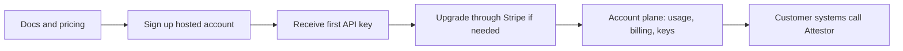

# Hosted Customer Journey

This document covers the hosted buying and onboarding flow only.

For plan definitions, pricing, hosted vs customer-operated packaging, and the production licensing boundary, use [Commercial packaging and pricing](product-packaging.md) as the source of truth.

## What this path is for

The hosted path is for teams that want a managed Attestor product surface without turning Attestor into the place where their files, workflows, wallets, or business systems live.

The customer keeps those systems where they already are, then calls Attestor where release decisions, proof, verification, authorization, and operational control are required.

## The 3-step view

The hosted path should be easy to understand:

1. create the hosted account
2. receive the first API key
3. upgrade through Stripe Checkout if a paid hosted plan is needed

After that, the same account remains the control point for keys, usage, entitlement, and billing.

## Buying flow

The first hosted commercial flow is:

1. the customer reads the docs and chooses a hosted plan
2. the customer signs up for a hosted account
3. Attestor returns the first tenant API key
4. the customer upgrades through Stripe Checkout when moving to a paid hosted plan
5. the same account carries the paid entitlement after checkout
6. the customer manages keys, usage, and billing from the hosted account plane
7. the customer calls Attestor from their own environment

## What to send and when

Use this sequence:

1. create the account
   send `accountName`, `email`, `displayName`, and `password` to `POST /api/v1/auth/signup`
2. start checkout for a paid hosted plan
   send `planId` (`starter`, `pro`, or `enterprise`) to `POST /api/v1/account/billing/checkout`
3. open the returned `checkoutUrl` and finish payment in Stripe
4. keep using the same account after checkout completes
5. manage billing later through `POST /api/v1/account/billing/portal`

## Minimum hosted account plane

The hosted account plane only needs to cover:

- current plan and entitlement state
- usage against quota
- API key lifecycle
- billing checkout and billing portal
- onboarding and docs links

That is enough to make the hosted product purchasable and usable.

## Hosted route contract

The hosted customer journey already maps to the shipped API surface:

- `POST /api/v1/auth/signup`
- `POST /api/v1/auth/login`
- `GET /api/v1/auth/me`
- `GET /api/v1/account`
- `GET /api/v1/account/usage`
- `GET /api/v1/account/entitlement`
- `GET /api/v1/account/api-keys`
- `POST /api/v1/account/api-keys`
- `POST /api/v1/account/api-keys/:id/rotate`
- `POST /api/v1/account/api-keys/:id/deactivate`
- `POST /api/v1/account/api-keys/:id/reactivate`
- `POST /api/v1/account/api-keys/:id/revoke`
- `POST /api/v1/account/billing/checkout`
- `POST /api/v1/account/billing/portal`
- `POST /api/v1/billing/stripe/webhook`

## What this document does not do

This document does not define:

- pricing
- plan packaging
- customer-operated deployment packaging
- production licensing terms

Those live in [Commercial packaging and pricing](product-packaging.md).
