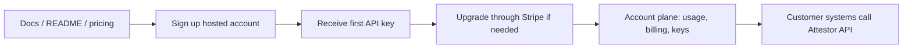

# Hosted Customer Journey

Attestor is bought and used as an API-first infrastructure product.

That means the customer does not come to Attestor to manage files in a hosted workspace. The customer keeps data, files, and business workflows in their own systems, then uses Attestor where governed acceptance, proof, verification, and operational control are required.

## The Core Product Shape

What the customer buys:

- hosted API access to the acceptance and proof layer
- a real account and tenant boundary
- API keys
- usage and billing visibility
- plan and entitlement state
- proof, verification, and filing-capable endpoints

What the customer does not buy:

- a file browser
- a drag-and-drop workspace
- a chat shell
- a generic AI productivity app

The category to preserve is:

**Acceptance, proof, and operating infrastructure for AI-assisted work, delivered as a hosted API product.**

## The Buying Flow

The first commercial flow should stay straightforward:

1. the customer reads the repo/docs and chooses a plan
2. the customer signs up for a hosted account
3. Attestor returns the first tenant API key immediately
4. the customer upgrades through Stripe Checkout when paid volume or support is needed
5. the same account now carries the paid entitlement
6. the customer manages keys, usage, and billing from the account plane
7. the customer calls Attestor from their own environment

## The 3-Second Version

If someone skims this page, they should still understand the buying path:

- `community` = try Attestor first
- `starter`, `pro`, `enterprise` = paid plans on the same account
- first create the account, then open Stripe Checkout for the plan, then pay, then keep using that same account

For the fuller public plan wording and run-sizing guidance, keep the README `Plans and Pricing` section as the source of truth.

## What To Send And When

Use this order:

1. create the account:
   send `accountName`, `email`, `displayName`, and `password` to `POST /api/v1/auth/signup`
2. start checkout for the plan:
   send `planId` (`starter`, `pro`, or `enterprise`) to `POST /api/v1/account/billing/checkout`
3. open the returned `checkoutUrl` and finish payment in Stripe
4. keep using the same account after checkout completes
5. manage invoices or payment details later through `POST /api/v1/account/billing/portal`

## Choosing A Plan

Keep the public packaging language simple:

- `community` = zero-cost evaluation and the first `10` hosted runs
- `starter` = the first paid hosted plan, good for one live workflow
- `pro` = the larger hosted plan for several workflows or one business unit
- `enterprise` = negotiated scale, hosted enterprise, or a customer-operated deployment boundary

This document stays focused on the buying sequence. The detailed plan wording lives in the README so it only needs maintenance in one place.

## The Minimum Hosted Account Plane

The account plane does not need to be a broad application. It only needs to cover the customer tasks that matter:

- current plan
- current entitlement state
- usage against quota
- API key lifecycle
- billing checkout and billing portal
- webhook and onboarding guidance

That is enough to make Attestor purchasable and usable.

## The Route Contract Behind The Buying Flow

The hosted customer journey already maps to the shipped API surface:

- `POST /api/v1/auth/signup`
- `POST /api/v1/auth/login`
- `GET /api/v1/auth/me`
- `GET /api/v1/account`
- `GET /api/v1/account/usage`
- `GET /api/v1/account/entitlement`
- `GET /api/v1/account/api-keys`
- `POST /api/v1/account/api-keys`
- `POST /api/v1/account/api-keys/:id/rotate`
- `POST /api/v1/account/api-keys/:id/deactivate`
- `POST /api/v1/account/api-keys/:id/reactivate`
- `POST /api/v1/account/api-keys/:id/revoke`
- `POST /api/v1/account/billing/checkout`
- `POST /api/v1/account/billing/portal`
- `POST /api/v1/billing/stripe/webhook`

## Commercial Surface

The practical commercial surface is:

- README for the public product and plan story
- this document for the hosted buying sequence
- Stripe Checkout plus Billing Portal for payment and plan management

## Commercial Truth

Attestor should not be framed as a thin utility API.

The customer is buying:

- governed acceptance
- proof
- verification
- operational control
- a durable account and billing surface around those capabilities

That is why the strongest description is still:

**Attestor is acceptance, proof, and operating infrastructure for AI-assisted work, delivered as a hosted API product.**
