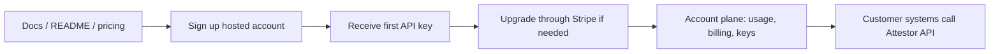

# Hosted Customer Journey

Attestor is bought and used as an API-first infrastructure product.

That means the customer does not come to Attestor to manage files in a hosted workspace. The customer keeps data, files, and business workflows in their own systems, then uses Attestor where governed acceptance, proof, verification, and operational control are required.

## The Core Product Shape

What the customer buys:

- hosted API access to the acceptance and proof layer
- a real account and tenant boundary
- API keys
- usage and billing visibility
- plan and entitlement state
- proof, verification, and filing-capable endpoints

What the customer does not buy:

- a file browser
- a drag-and-drop workspace
- a chat shell
- a generic AI productivity app

The category to preserve is:

**Acceptance, proof, and operating infrastructure for AI-assisted work, delivered as a hosted API product.**

## The Buying Flow

The first commercial flow should stay straightforward:

1. the customer reads the repo/docs and chooses a plan
2. the customer signs up for a hosted account
3. Attestor returns the first tenant API key immediately
4. the customer upgrades through Stripe Checkout when paid volume or support is needed
5. the same account now carries the paid entitlement
6. the customer manages keys, usage, and billing from the account plane
7. the customer calls Attestor from their own environment

## The 3-Second Version

If someone skims this page, they should still understand the buying path:

- `community` = try Attestor first
- `starter`, `pro`, `enterprise` = paid plans on the same account
- first create the account, then open Stripe Checkout for the plan, then pay, then keep using that same account

## What To Send And When

Use this order:

1. create the account:
   send `accountName`, `email`, `displayName`, and `password` to `POST /api/v1/auth/signup`
2. start checkout for the plan:
   send `planId` (`starter`, `pro`, or `enterprise`) to `POST /api/v1/account/billing/checkout`
3. open the returned `checkoutUrl` and finish payment in Stripe
4. keep using the same account after checkout completes
5. manage invoices or payment details later through `POST /api/v1/account/billing/portal`

## Billing In One Minute

If a customer asks "how does payment work?" the answer should stay this simple:

1. `community` covers the zero-cost evaluation path, but included hosted pipeline volume starts at `starter`.
2. hosted signup creates the account the customer keeps using.
3. `starter` is the first hosted paid plan and begins with a 14-day free trial.
4. `pro` and `enterprise` are paid upgrades on that same account.
5. Stripe Checkout starts the plan, and the Stripe Billing Portal is where payment details, invoices, and plan changes are managed.

That is the whole payment story most buyers need before they decide whether to continue.

## Entry Path By Plan

### Community

For developers, internal evaluation, and self-hosted validation.

Expected path:

1. read the repo and docs
2. self-host the stack locally or in the team's own environment
3. validate the acceptance model against real internal workflows
4. optionally create a hosted account early, then move to hosted `starter` when real hosted usage is needed

### Starter

For the first serious production team.

Expected path:

1. sign up hosted account
2. start the 14-day free trial through Stripe Checkout
3. manage API keys and usage
4. integrate one real workflow from the customer's own stack

### Pro

For repeated internal operational use across more than one workflow or business unit.

Expected path:

1. sign up or convert an existing community/starter account
2. purchase higher hosted limits through Stripe
3. operate multiple internal integrations from the same account plane

### Enterprise

For banks, hospitals, insurers, and internal AI platform teams with stricter rollout boundaries.

Expected path:

1. qualify the deployment boundary and commercial shape
2. close the commercial agreement
3. onboard hosted enterprise or private deployment

Enterprise can stay sales-led even if `starter` and `pro` are self-serve.

## The Minimum Hosted Account Plane

The account plane does not need to be a broad application. It only needs to cover the customer tasks that matter:

- current plan
- current entitlement state
- usage against quota
- API key lifecycle
- billing checkout and billing portal
- webhook and onboarding guidance

That is enough to make Attestor purchasable and usable.

## The Route Contract Behind The Buying Flow

The hosted customer journey already maps to the shipped API surface:

- `POST /api/v1/auth/signup`
- `POST /api/v1/auth/login`
- `GET /api/v1/auth/me`
- `GET /api/v1/account`
- `GET /api/v1/account/usage`
- `GET /api/v1/account/entitlement`
- `GET /api/v1/account/api-keys`
- `POST /api/v1/account/api-keys`
- `POST /api/v1/account/api-keys/:id/rotate`
- `POST /api/v1/account/api-keys/:id/deactivate`
- `POST /api/v1/account/api-keys/:id/reactivate`
- `POST /api/v1/account/api-keys/:id/revoke`
- `POST /api/v1/account/billing/checkout`
- `POST /api/v1/account/billing/portal`
- `POST /api/v1/billing/stripe/webhook`

## Commercial Surface

The repo and docs can already serve as the initial commercial surface when they clearly answer:

- what Attestor is
- who it is for
- which plan the customer should choose
- how signup works
- how billing works
- how API access is issued

That means a credible first launch surface can be:

- GitHub repo
- README
- docs
- Stripe Checkout-backed hosted account flow

The customer still gets a real commercial product:

- hosted account
- API access
- usage and billing
- documented integration path

## Commercial Truth

Attestor should not be framed as a thin utility API.

The customer is buying:

- governed acceptance
- proof
- verification
- operational control
- a durable account and billing surface around those capabilities

That is why the strongest description is still:

**Attestor is acceptance, proof, and operating infrastructure for AI-assisted work, delivered as a hosted API product.**
