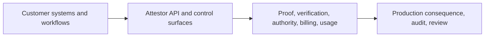

# Product Packaging and Pricing

Attestor is not sold as a file-management app or a generic AI workspace.

It is sold as **acceptance, proof, and operating infrastructure for AI-assisted work**, delivered either as:

- a **hosted API product**
- or a **private deployment** for teams that need stricter control boundaries

That is the central commercial truth to preserve in every public description.

## What Customers Actually Buy

Customers are not buying an upload interface.

They are buying:

- governed acceptance infrastructure
- portable proof and verification
- authority closure and auditability
- hosted account, billing, and usage surfaces
- API access they can call from their own environment

Their files, data, workflows, and business logic stay in **their** systems.

Attestor sits around the acceptance boundary:

## Buying Model

The commercial flow should stay simple:

1. choose a plan
2. pay through Stripe Checkout
3. receive hosted account access and API credentials
4. use Attestor from the customer's own environment

That means the first customer-facing product surface only needs to cover:

- plan selection
- checkout
- account overview
- API key management
- usage
- billing
- docs

It does **not** need a document workspace or file browser.

## Recommended Public Pricing

These are the recommended list prices for the hosted product.

They are intentionally not cheap. Attestor is not a utility wrapper. It is infrastructure for high-consequence AI-assisted work.

| Plan | Recommended price | Best for | Included hosted shape |
|---|---:|---|---|
| Community | Free | self-hosted evaluation, internal development, OSS experimentation | self-host only, local proof path, docs, no hosted SLA |
| Starter | $499 / month | first production teams, pilot-to-production workflows, small internal rollout | 100 governed runs / month, hosted account + API access, usage and billing surface, API keys, bounded hosted control layer |
| Pro | $1,999 / month | repeated operational use, multiple workflows, higher internal adoption | 1,000 governed runs / month, higher rate limits, stronger async/runtime capacity, hosted account/billing/usage surfaces, richer operational headroom |
| Enterprise | From $7,500 / month | banks, hospitals, insurers, large AI platform teams, private deployment buyers | negotiated limits, hosted or private deployment, commercial support path, security/compliance onboarding, custom rollout boundary |

These prices should map to the Stripe price ids configured through:

- `ATTESTOR_STRIPE_PRICE_STARTER`
- `ATTESTOR_STRIPE_PRICE_PRO`
- `ATTESTOR_STRIPE_PRICE_ENTERPRISE`

## Commercial Bootstrap

The minimum hosted commercial contract is intentionally small.

To make the paid plans actually purchasable, configure:

- `STRIPE_API_KEY`
- `STRIPE_WEBHOOK_SECRET`
- `ATTESTOR_STRIPE_PRICE_STARTER`
- `ATTESTOR_STRIPE_PRICE_PRO`
- `ATTESTOR_STRIPE_PRICE_ENTERPRISE`
- `ATTESTOR_BILLING_SUCCESS_URL`
- `ATTESTOR_BILLING_CANCEL_URL`
- `ATTESTOR_BILLING_PORTAL_RETURN_URL`

After that, the runtime already exposes the core buying and account-management surface:

- `POST /api/v1/account/billing/checkout`
- `POST /api/v1/account/billing/portal`
- `POST /api/v1/billing/stripe/webhook`
- `GET /api/v1/account`
- `GET /api/v1/account/usage`
- `GET /api/v1/account/entitlement`

## Why The Pricing Should Not Be Cheap

Attestor is valuable when AI output is no longer just a suggestion.

Once output can influence:

- reporting
- financial decisions
- healthcare review
- claims operations
- compliance
- audit exposure
- production consequence

the missing layer is not another cheap inference endpoint. It is the acceptance and control infrastructure around that output.

That is why Attestor should price more like:

- developer infrastructure
- security/control infrastructure
- high-trust operational software

and less like:

- commodity generation APIs
- lightweight wrappers
- casual productivity SaaS

## What Each Plan Means In Practice

### Community

For teams proving the model locally or running self-hosted evaluation.

What they get:

- the repository
- docs
- local proof and verification paths
- self-hosted experimentation

What they do **not** get:

- hosted support commitments
- hosted operational guarantees
- commercial onboarding

### Starter

For a team that wants to put Attestor in front of one real workflow and buy hosted access without building a governance layer from scratch.

What they get:

- hosted API access
- hosted account and tenant state
- API key management
- usage view
- billing view
- bounded monthly included volume

### Pro

For teams where Attestor becomes part of repeated operating practice rather than a single pilot.

What they get:

- materially more monthly volume
- higher throughput and queue headroom
- better fit for multiple internal workflows
- stronger fit for real operational use

### Enterprise

For organizations where procurement, compliance, uptime, and deployment boundary matter as much as feature list.

What they get:

- negotiated limits
- custom commercial path
- hosted or private deployment shape
- structured onboarding for control, security, and rollout

## Product Truth To Preserve Everywhere

Do not describe Attestor as:

- a file uploader
- an AI workspace
- a document management app
- a generic AI-for-everything platform

Describe it as:

**Acceptance, proof, and operating infrastructure for AI-assisted work, delivered as a hosted API product.**
