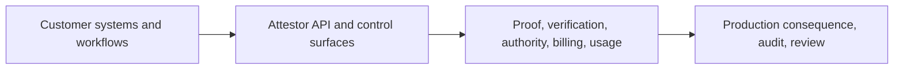

# Product Packaging and Pricing

Attestor is not sold as a file-management app or a generic AI workspace.

It is sold as **acceptance, proof, and operating infrastructure for AI-assisted work**, delivered either as:

- a **hosted API product**
- or a **customer-operated deployment path** for teams that need stricter control boundaries

That is the central commercial truth to preserve in every public description.

## What Customers Actually Buy

Customers are not buying an upload interface.

They are buying:

- governed acceptance infrastructure
- portable proof and verification
- authority closure and auditability
- hosted account, billing, and usage surfaces
- API access they can call from their own environment

Their files, data, workflows, and business logic stay in **their** systems.

Attestor sits around the acceptance boundary:

## Buying Model

The commercial flow should stay simple:

1. choose a plan
2. sign up and receive a hosted account plus first API key
3. pay through Stripe Checkout when a paid plan is needed
4. receive the paid entitlement on the same hosted account
5. use Attestor from the customer's own environment

That means the first customer-facing product surface only needs to cover:

- plan selection
- checkout
- account overview
- API key management
- usage
- billing
- docs

It does **not** need a document workspace or file browser.

The commercial rule to preserve is simple:

- zero-cost evaluation can start with the repo or a hosted account signup
- `community` includes the first `10` hosted runs before a paid hosted plan is needed

## Commercial Surface

Keep the surface split small:

- README = public product and plan explanation
- hosted customer journey = signup and checkout sequence
- Stripe commercial bootstrap = operator setup

That avoids maintaining the same commercial story in three places.

## Where Customer Payment And Your Bank Account Meet

Attestor itself does not collect money into your bank account.

The hosted paid path works like this:

1. the customer pays through Stripe Checkout
2. Stripe records the payment on your Stripe balance
3. Stripe later pays out to the bank account you connected on the Stripe side

So your bank details matter when you activate live Stripe payouts, not inside the Attestor product surface itself.

## Minimum Hosted Account Plane

The hosted account plane only needs to do a few things well:

- show the current plan and entitlement state
- show usage against quota
- manage API keys
- let the customer upgrade or manage billing
- point back to docs and quick integration examples

That is enough for the first complete product line.

## Recommended Public Pricing

Keep the README `Plans and Pricing` section as the single source of truth for buyer-facing copy.

This file should preserve the internal packaging rule behind that public table:

- `community` = free evaluation path plus the first `10` hosted runs
- `starter` = EUR 499 / month for one serious team and one live workflow
- `pro` = EUR 1,999 / month for several workflows or one business unit
- `enterprise` = from EUR 7,500 / month for negotiated scale, stricter rollout, or a customer-operated deployment path

These prices should map to the Stripe price ids configured through:

- `ATTESTOR_STRIPE_PRICE_STARTER`
- `ATTESTOR_STRIPE_PRICE_PRO`
- `ATTESTOR_STRIPE_PRICE_ENTERPRISE`
- `ATTESTOR_STRIPE_STARTER_TRIAL_DAYS`

## Commercial Bootstrap

The minimum hosted commercial contract is intentionally small.

To make the paid plans actually purchasable, configure:

- `STRIPE_API_KEY`
- `STRIPE_WEBHOOK_SECRET`
- `ATTESTOR_STRIPE_PRICE_STARTER`
- `ATTESTOR_STRIPE_PRICE_PRO`
- `ATTESTOR_STRIPE_PRICE_ENTERPRISE`
- `ATTESTOR_STRIPE_STARTER_TRIAL_DAYS`
- `ATTESTOR_BILLING_SUCCESS_URL`
- `ATTESTOR_BILLING_CANCEL_URL`
- `ATTESTOR_BILLING_PORTAL_RETURN_URL`

After that, the runtime already exposes the core buying and account-management surface:

- `POST /api/v1/auth/signup`
- `POST /api/v1/account/billing/checkout`
- `POST /api/v1/account/billing/portal`
- `POST /api/v1/billing/stripe/webhook`
- `GET /api/v1/account`
- `GET /api/v1/account/usage`
- `GET /api/v1/account/entitlement`
- `GET /api/v1/account/api-keys`
- `POST /api/v1/account/api-keys`
- `POST /api/v1/account/api-keys/:id/rotate`
- `POST /api/v1/account/api-keys/:id/deactivate`
- `POST /api/v1/account/api-keys/:id/reactivate`
- `POST /api/v1/account/api-keys/:id/revoke`

## Why The Pricing Should Not Be Cheap

Attestor is valuable when AI output is no longer just a suggestion.

Once output can influence:

- reporting
- financial decisions
- healthcare review
- claims operations
- compliance
- audit exposure
- production consequence

the missing layer is not another cheap inference endpoint. It is the acceptance and control infrastructure around that output.

That is why Attestor should price more like:

- developer infrastructure
- security/control infrastructure
- high-trust operational software

and less like:

- commodity generation APIs
- lightweight wrappers
- casual productivity SaaS

## Fastest Way To Sell It

The fastest enterprise sales pattern is to avoid pitching Attestor as a generic AI layer.

Pitch it as:

- the acceptance and control plane between model output and production consequence
- the evidence system that makes reviewer signoff and later audit possible
- the operational product surface that procurement can actually buy: account, usage, billing, entitlement, and deployment boundary

That mirrors how strong infrastructure sellers win enterprise adoption: they sell control, legibility, and rollout safety before they sell convenience.

## Product Truth To Preserve Everywhere

Do not describe Attestor as:

- a file uploader
- an AI workspace
- a document management app
- a generic AI-for-everything platform

Describe it as:

**Acceptance, proof, and operating infrastructure for AI-assisted work, delivered as a hosted API product.**
