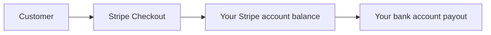

# Stripe Commercial Bootstrap

This is the minimum operator checklist for turning Attestor from a technically live hosted API into a product that customers can actually buy.

## What Customers See

From the customer's side, the commercial shape stays simple:

1. choose a plan
2. sign up for a hosted account
3. upgrade through Stripe Checkout when `starter`, `pro`, or `enterprise` is needed
4. return to the Attestor account plane
5. manage API keys, usage, and billing

Customers do not need to understand your payout setup. They only need a clear plan choice and a reliable checkout path.

## What You Must Set Up As The Operator

### 1. Create The Live Stripe Prices

Create recurring Stripe prices for:

- `starter`
- `pro`
- `enterprise`

The recommended public list prices are:

- `starter`: `EUR 499 / month`
- `pro`: `EUR 1,999 / month`
- `enterprise`: `from EUR 7,500 / month`

Map those live Stripe price ids into:

- `ATTESTOR_STRIPE_PRICE_STARTER`
- `ATTESTOR_STRIPE_PRICE_PRO`
- `ATTESTOR_STRIPE_PRICE_ENTERPRISE`

For the default hosted funnel:

- `community` covers the zero-cost evaluation path and includes the first `10` hosted runs
- `starter` is the self-serve hosted entry plan and the first paid hosted plan
- `starter` carries a `14-day free trial`
- `pro` and `enterprise` do not get an automatic self-serve trial by default

### 2. Activate Your Stripe Live Account

The hosted paid plans are not truly live until the Stripe account itself is live-ready.

That usually means:

- legal business details entered in Stripe
- support/business profile completed
- payout account configured
- live API key available

## When Your Bank Details Are Needed

Your bank details are needed when you want Stripe to pay out your sales balance to you.

The money flow is:



So the sequence is:

1. the customer pays Stripe
2. Stripe receives and records the charge
3. Stripe transfers your available balance to the bank account you connected for payouts

That means:

- the bank account is part of **your Stripe live setup**
- it is **not** something Attestor stores or handles
- it is **not** required for free `community` signups
- it **is** required before you can honestly call the product commercially live

## 3. Configure The Attestor Runtime

Set these runtime variables on the hosted deployment:

```bash
export STRIPE_API_KEY=sk_live_...
export STRIPE_WEBHOOK_SECRET=whsec_...
export ATTESTOR_STRIPE_PRICE_STARTER=price_...
export ATTESTOR_STRIPE_PRICE_PRO=price_...
export ATTESTOR_STRIPE_PRICE_ENTERPRISE=price_...
export ATTESTOR_STRIPE_STARTER_TRIAL_DAYS=14
export ATTESTOR_BILLING_SUCCESS_URL=https://<host>/billing/success
export ATTESTOR_BILLING_CANCEL_URL=https://<host>/billing/cancel
export ATTESTOR_BILLING_PORTAL_RETURN_URL=https://<host>/settings/billing
```

## 4. Wire The Webhook

Create a Stripe webhook endpoint that targets:

- `POST /api/v1/billing/stripe/webhook`

Stripe webhooks are what make the billing state actually converge back into Attestor:

- checkout completion
- subscription state changes
- invoice outcomes
- charge outcomes
- entitlement updates

Without the webhook, checkout can start, but the hosted account state is not truly production-grade.

## 5. Keep The Runtime Flow Small

Attestor does not need a large commercial frontend to be sellable.

The minimum valid commercial surface is:

- pricing information in repo/docs
- hosted signup
- Stripe Checkout upgrade path
- account plane for keys, usage, and billing

That is enough to make the hosted API product purchasable.

## What "Commercially Live" Means For Attestor

Attestor is commercially live when all of these are true:

- live Stripe prices exist
- Stripe live account is activated
- payout bank account is connected in Stripe
- Attestor runtime has the live Stripe env vars
- Stripe webhook is pointed at the live Attestor deployment
- a paid checkout can complete and reflect back into the hosted account plane

Until then, the product may still be technically live and usable, but it is not yet fully sale-ready.
