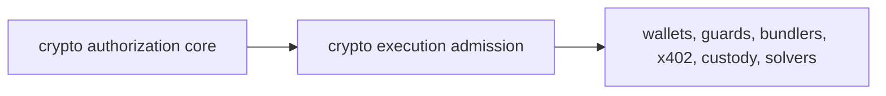

# Crypto Execution Admission Surface

Attestor now exposes the first crypto execution admission layer through:

- `attestor/crypto-execution-admission`

This is the layer after `attestor/crypto-authorization-core`.

The core answers:

- what is the proposed programmable-money consequence?
- what risk, release decision, policy scope, enforcement binding, and adapter preflight apply?
- is the candidate ready, blocked, or missing evidence?

The admission layer answers:

- which execution surface is involved?
- what artifacts must be handed to that surface?
- what must be blocked?
- what missing evidence must be collected?
- what receipt must be recorded after downstream execution is attempted?

## Public Contract

The public subpath exposes:

- `createCryptoExecutionAdmissionPlan()`
- `createWalletRpcAdmissionHandoff()`
- `cryptoExecutionAdmissionAdapterProfile()`
- `cryptoExecutionAdmissionDescriptor()`
- `cryptoExecutionAdmissionLabel()`
- `walletRpcAdmissionDescriptor()`
- `walletRpcAdmissionHandoffLabel()`
- versioned admission outcomes, surfaces, step kinds, and step statuses

The first planner maps existing crypto authorization simulation results onto these surfaces:

| Adapter | Admission surface |
|---|---|
| `safe-guard` | `smart-account-guard` |
| `safe-module-guard` | `smart-account-guard` |
| `erc-4337-user-operation` | `account-abstraction-bundler` |
| `erc-7579-module` | `modular-account-runtime` |
| `erc-6900-plugin` | `modular-account-runtime` |
| `eip-7702-delegation` | `delegated-eoa-runtime` |
| `wallet-call-api` | `wallet-rpc` |
| `x402-payment` | `agent-payment-http` |
| `custody-cosigner` | `custody-policy-engine` |
| `intent-settlement` | `intent-solver` |

The wallet RPC handoff maps a wallet-ready admission plan into:

| Standard | Handoff role |
|---|---|
| EIP-5792 | capability discovery, `wallet_sendCalls`, call status tracking, and atomic execution expectations |
| ERC-7715 | execution-permission request construction, supported-permission discovery, rule validation, and permission next actions |
| ERC-7902 | account-abstraction capability expectations such as `eip7702Auth`, validity windows, paymaster configuration, multidimensional nonce, and gas override support |

The handoff deliberately keeps Attestor outside the wallet role. It creates JSON-RPC request objects and an optional `attestorAdmission` sidecar capability for compatible wallets, but the admission receipt and policy proof remain Attestor artifacts.

## Why It Is Separate From The Core

The crypto authorization core must stay stable and adapter-neutral. Execution admission is closer to integration surfaces. It is allowed to know that an x402 handoff needs `PAYMENT-REQUIRED`, `PAYMENT-SIGNATURE`, and `PAYMENT-RESPONSE`, or that ERC-4337 admission must carry bundler simulation evidence.

That keeps the dependency direction clean:



## Consumption Example

```ts
import {
  createCryptoExecutionAdmissionPlan,
  createWalletRpcAdmissionHandoff,
} from 'attestor/crypto-execution-admission';

const plan = createCryptoExecutionAdmissionPlan({
  simulation,
  createdAt: new Date().toISOString(),
  integrationRef: 'integration:x402:premium-api',
});

if (plan.outcome === 'deny') {
  throw new Error(plan.blockedReasons.join(', '));
}

const walletHandoff = createWalletRpcAdmissionHandoff({
  plan,
  createdAt: new Date().toISOString(),
  calls: [
    {
      to: '0x2222222222222222222222222222222222222222',
      data: '0x1234',
    },
  ],
});

if (walletHandoff.outcome === 'blocked') {
  throw new Error(walletHandoff.blockingReasons.join(', '));
}
```

## What Stays Internal

These paths are not public package API:

- `attestor/crypto-execution-admission/*.js`
- `attestor/crypto-authorization-core/*.js`
- service runtime internals

The package subpath is intentionally narrow so the admission layer can grow without freezing every internal file.
