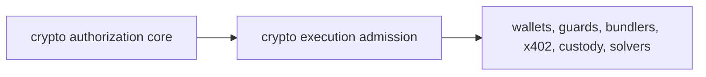

# Crypto Execution Admission Surface

Attestor now exposes the first crypto execution admission layer through:

- `attestor/crypto-execution-admission`

This is the layer after `attestor/crypto-authorization-core`.

The core answers:

- what is the proposed programmable-money consequence?
- what risk, release decision, policy scope, enforcement binding, and adapter preflight apply?
- is the candidate ready, blocked, or missing evidence?

The admission layer answers:

- which execution surface is involved?
- what artifacts must be handed to that surface?
- what must be blocked?
- what missing evidence must be collected?
- what receipt must be recorded after downstream execution is attempted?

## Public Contract

The public subpath exposes:

- `createCryptoExecutionAdmissionPlan()`
- `createErc4337BundlerAdmissionHandoff()`
- `createWalletRpcAdmissionHandoff()`
- `createSafeGuardAdmissionReceipt()`
- `cryptoExecutionAdmissionAdapterProfile()`
- `cryptoExecutionAdmissionDescriptor()`
- `cryptoExecutionAdmissionLabel()`
- `erc4337BundlerAdmissionDescriptor()`
- `erc4337BundlerAdmissionHandoffLabel()`
- `safeGuardAdmissionDescriptor()`
- `safeGuardAdmissionReceiptLabel()`
- `walletRpcAdmissionDescriptor()`
- `walletRpcAdmissionHandoffLabel()`
- versioned admission outcomes, surfaces, step kinds, and step statuses

The first planner maps existing crypto authorization simulation results onto these surfaces:

| Adapter | Admission surface |
|---|---|
| `safe-guard` | `smart-account-guard` |
| `safe-module-guard` | `smart-account-guard` |
| `erc-4337-user-operation` | `account-abstraction-bundler` |
| `erc-7579-module` | `modular-account-runtime` |
| `erc-6900-plugin` | `modular-account-runtime` |
| `eip-7702-delegation` | `delegated-eoa-runtime` |
| `wallet-call-api` | `wallet-rpc` |
| `x402-payment` | `agent-payment-http` |
| `custody-cosigner` | `custody-policy-engine` |
| `intent-settlement` | `intent-solver` |

The wallet RPC handoff maps a wallet-ready admission plan into:

| Standard | Handoff role |
|---|---|
| EIP-5792 | capability discovery, `wallet_sendCalls`, call status tracking, and atomic execution expectations |
| ERC-7715 | execution-permission request construction, supported-permission discovery, rule validation, and permission next actions |
| ERC-7902 | account-abstraction capability expectations such as `eip7702Auth`, validity windows, paymaster configuration, multidimensional nonce, and gas override support |

The handoff deliberately keeps Attestor outside the wallet role. It creates JSON-RPC request objects and an optional `attestorAdmission` sidecar capability for compatible wallets, but the admission receipt and policy proof remain Attestor artifacts.

Safe guard admission receipts map Safe pre/post hook evidence into durable Attestor receipts:

| Safe surface | Receipt role |
|---|---|
| Transaction guard | Binds `checkTransaction` / `checkAfterExecution`, Safe transaction hash, guard interface support, and owner recovery posture |
| Module guard | Binds `checkModuleTransaction` / `checkAfterModuleExecution`, module transaction hash, module address, module-guard interface support, and module disablement recovery |

The receipt does not deploy or replace a Safe guard. It proves that the Safe guard path was admitted by Attestor, names the required interface id, carries the canonical preflight digest, and fails closed if the guard is not enabled, lacks ERC-165/interface support, mismatches the admitted Safe, or cannot be recovered by owners.

ERC-4337 bundler admission handoffs map UserOperation preflight evidence into ERC-7769 JSON-RPC requests:

| Bundler method | Handoff role |
|---|---|
| `eth_chainId` | Confirm the bundler endpoint is serving the admitted EIP-155 chain |
| `eth_supportedEntryPoints` | Confirm the admitted EntryPoint is accepted by the bundler |
| `eth_estimateUserOperationGas` | Collect gas evidence before submission and block under-provisioned UserOperations |
| `eth_sendUserOperation` | Submit only after Attestor admission, EntryPoint support, ERC-7562 posture, and gas fit are satisfied |
| `eth_getUserOperationByHash` / `eth_getUserOperationReceipt` | Track inclusion and persist the downstream result against the Attestor handoff |

The handoff does not become a bundler or paymaster. It packages the UserOperation, EntryPoint, chain, gas estimate, ERC-7562 validation-scope expectation, paymaster posture, and Attestor sidecar into a deterministic pre-submission object.

## Why It Is Separate From The Core

The crypto authorization core must stay stable and adapter-neutral. Execution admission is closer to integration surfaces. It is allowed to know that an x402 handoff needs `PAYMENT-REQUIRED`, `PAYMENT-SIGNATURE`, and `PAYMENT-RESPONSE`, or that ERC-4337 admission must carry bundler simulation evidence.

That keeps the dependency direction clean:



## Consumption Example

```ts
import {
  createCryptoExecutionAdmissionPlan,
  createErc4337BundlerAdmissionHandoff,
  createSafeGuardAdmissionReceipt,
  createWalletRpcAdmissionHandoff,
} from 'attestor/crypto-execution-admission';

const walletPlan = createCryptoExecutionAdmissionPlan({
  simulation,
  createdAt: new Date().toISOString(),
  integrationRef: 'integration:wallet-rpc:treasury',
});

if (walletPlan.outcome === 'deny') {
  throw new Error(walletPlan.blockedReasons.join(', '));
}

const walletHandoff = createWalletRpcAdmissionHandoff({
  plan: walletPlan,
  createdAt: new Date().toISOString(),
  calls: [
    {
      to: '0x2222222222222222222222222222222222222222',
      data: '0x1234',
    },
  ],
});

if (walletHandoff.outcome === 'blocked') {
  throw new Error(walletHandoff.blockingReasons.join(', '));
}

const safePlan = createCryptoExecutionAdmissionPlan({
  simulation: safeGuardSimulation,
  createdAt: new Date().toISOString(),
  integrationRef: 'integration:safe-guard:treasury',
});

const safeReceipt = createSafeGuardAdmissionReceipt({
  plan: safePlan,
  preflight: safeGuardPreflight,
  createdAt: new Date().toISOString(),
  installation: {
    guardAddress: '0x4444444444444444444444444444444444444444',
    supportsErc165: true,
    supportsGuardInterface: true,
    enabledOnSafe: true,
  },
  recovery: {
    guardCanBeRemovedByOwners: true,
    emergencySafeTxPrepared: true,
  },
});

if (safeReceipt.outcome === 'blocked') {
  throw new Error(safeReceipt.blockingReasons.join(', '));
}

const bundlerPlan = createCryptoExecutionAdmissionPlan({
  simulation: erc4337Simulation,
  createdAt: new Date().toISOString(),
  integrationRef: 'integration:erc4337:bundler',
});

const bundlerHandoff = createErc4337BundlerAdmissionHandoff({
  plan: bundlerPlan,
  preflight: erc4337Preflight,
  userOperation,
  createdAt: new Date().toISOString(),
});

if (bundlerHandoff.outcome === 'blocked') {
  throw new Error(bundlerHandoff.blockingReasons.join(', '));
}
```

## What Stays Internal

These paths are not public package API:

- `attestor/crypto-execution-admission/*.js`
- `attestor/crypto-authorization-core/*.js`
- service runtime internals

The package subpath is intentionally narrow so the admission layer can grow without freezing every internal file.
