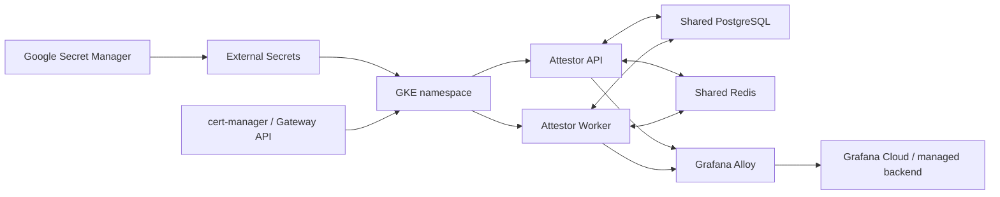

# Production Readiness Guide

Attestor is now at the point where the main remaining work is not another large engineering block in the repo. It is **environment promotion**: real secrets, real cloud material, real benchmark data, and a disciplined rollout sequence.

This guide uses the **recommended path today**:

- **GKE**
- **Workload Identity**
- **Google Secret Manager**
- **External Secrets**
- **Gateway API + cert-manager**
- **Grafana Alloy / Grafana Cloud**
- **shared PostgreSQL**
- **shared Redis**

AWS remains supported. This guide chooses GKE because it is currently the cleanest repo-guided path end to end.

## What "Ready" Means Here

Attestor is ready for production promotion when all three are true:

1. the **repo pipeline** is green
2. the **environment inputs** are present and reachable
3. the **benchmark + render + probe + packet** chain returns `ready-for-environment-promotion`

That is the practical line between "good code" and "rollout-ready system".

## Recommended Stack



## Step 1: Provision the Target Environment

Before rendering anything, the target environment should already exist:

- a GKE cluster
- a public hostname
- Gateway API available
- `cert-manager` installed, or a clear TLS strategy chosen
- External Secrets Operator installed
- shared PostgreSQL reachable from the cluster
- shared Redis reachable from the cluster
- a managed observability backend chosen

Recommended defaults:

- TLS: `cert-manager`
- secret delivery: `external-secret`
- observability provider: `grafana-alloy`
- HA provider: `gke`

## Step 2: Bootstrap the Secret Contract

Render the exact secret contract for GKE:

```bash
npm run render:secret-manager-bootstrap -- --provider=gke
```

This emits:

- GKE `ClusterSecretStore` bootstrap material
- the remote secret catalog
- seed payload examples

Important detail:

- Attestor keeps **logical** secret names human-readable
- when the backend is GKE / Google Secret Manager, slash-separated logical names are normalized into **GSM-safe remote ids**

That avoids a real class of rollout bugs where AWS-style path naming leaks into GSM.

## Step 3: Populate Real Secrets

The repo can render the contract. It cannot invent the real values.

You still need to load:

### Observability secrets

- `GRAFANA_CLOUD_OTLP_ENDPOINT`
- `GRAFANA_CLOUD_OTLP_USERNAME`
- `GRAFANA_CLOUD_OTLP_TOKEN`
- `ALERTMANAGER_DEFAULT_WEBHOOK_URL`
- `ALERTMANAGER_WARNING_WEBHOOK_URL`
- `ALERTMANAGER_CRITICAL_PAGERDUTY_ROUTING_KEY`
- any security / billing / Slack / email routing secrets you actually use

### HA / runtime secrets

- `REDIS_URL`
- `ATTESTOR_CONTROL_PLANE_PG_URL`
- `ATTESTOR_BILLING_LEDGER_PG_URL`
- optional `ATTESTOR_PG_URL`
- `ATTESTOR_ADMIN_API_KEY`
- TLS material if you are not delegating certificate issuance elsewhere

### Runtime identity / routing inputs

- `ATTESTOR_PUBLIC_HOSTNAME`
- `ATTESTOR_API_IMAGE`
- `ATTESTOR_WORKER_IMAGE`

## Step 4: Measure the Real Environment

Run fresh benchmarks against the actual target environment.

### Observability benchmark

```bash
npm run benchmark:observability -- --prometheus-url=https://<prometheus> --alertmanager-url=https://<alertmanager>
```

This captures:

- live request rate
- availability
- p95 latency
- active alerts

### HA benchmark

```bash
npm run benchmark:ha -- --url=https://<public-host>/api/v1/health
```

This captures:

- health/availability truth
- calibration data used by the HA renderer chain

## Step 5: Render the Promotion Assets

### Observability chain

```bash
npm run render:observability-profile -- --input=.attestor/observability/calibration/latest/benchmark.json --profile=ops/observability/profiles/regulated-production.json
npm run render:observability-credentials
npm run render:observability-release-bundle
npm run probe:observability-release-inputs
npm run render:observability-promotion-packet
```

### HA chain

```bash
npm run render:ha-profile -- --input=.attestor/ha-calibration/latest.json --profile=ops/kubernetes/ha/profiles/gke-production.json
npm run render:ha-credentials
npm run render:ha-release-bundle
npm run probe:ha-runtime-connectivity
npm run probe:ha-release-inputs
npm run render:ha-promotion-packet
```

## Step 6: Render the Final Combined Gate

```bash
npm run render:production-readiness-packet -- --observability-provider=grafana-alloy --observability-benchmark=.attestor/observability/calibration/latest/benchmark.json --ha-provider=gke --ha-benchmark=.attestor/ha-calibration/latest.json --prometheus-url=https://<prometheus> --alertmanager-url=https://<alertmanager>
```

This is the final repo-side handoff.

If the packet says:

- `ready-for-environment-promotion`: the repo pipeline and environment inputs line up
- `blocked-on-environment-inputs`: stop and fix the listed missing inputs or stale benchmarks first

## Step 7: Apply and Validate

Once the packet is green:

1. apply the observability bundle
2. apply the HA bundle
3. wait for rollout completion
4. confirm API `/api/v1/ready`
5. confirm worker `/ready`
6. confirm traces/logs/metrics reach the backend
7. confirm alert routing reaches the real destinations
8. confirm Stripe / hosted auth / queue / billing critical paths still behave correctly

## Step 8: Run a Short Production Rehearsal

Do not stop at "the pods came up".

Run a short but real rehearsal:

- rolling restart
- worker drain / recovery
- one alert-routing exercise
- one benchmark refresh
- one restore/DR exercise if this is a serious environment

That is what converts a technically correct deployment into an operationally credible one.

## Exit Criteria

You can call the deployment production-ready when all of these are true:

- production readiness packet is green
- observability packet is green
- HA packet is green
- real secrets are loaded from the chosen secret backend
- live traces/logs/metrics are visible
- alerts reach the intended receivers
- shared PostgreSQL and Redis are reachable from the running workload
- the public hostname and TLS path work end to end
- at least one rehearsal rollout has succeeded cleanly

## What Still Remains Outside the Repo

This is the honest boundary.

The repository can now:

- render the bundles
- verify the inputs
- probe the endpoints
- produce rollout checkpoints

But it still cannot do these things without your real environment:

- create your cloud accounts
- choose your domains
- mint your certificates
- provide your real OTLP / PagerDuty / webhook credentials
- produce real production traffic on its own

That is not a weakness in the repo. It is the natural boundary between shipped software and real operations.
